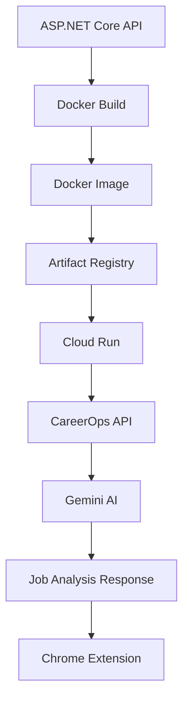

# CareerOps API Deployment Guide

Complete deployment guide for CareerOps API using **.NET 9**, **Docker**, **Google Artifact Registry**, **Cloud Run**, and **Gemini AI**.

---

# Architecture Overview

```text
Chrome Extension
        │
        ▼
CareerOps API
(Google Cloud Run)
        │
        ▼
Gemini AI
        │
        ▼
Job Analysis
        │
        ▼
Google Sheets Tracker
```

---

# Technology Stack

| Component          | Technology               |
| ------------------ | ------------------------ |
| Backend API        | ASP.NET Core 9           |
| AI Engine          | Google Gemini            |
| Containerization   | Docker                   |
| Container Registry | Google Artifact Registry |
| Hosting            | Google Cloud Run         |
| Frontend           | Chrome Extension         |
| Data Storage       | Google Sheets            |
| OS                 | Windows + WSL2           |

---

# Prerequisites

Install the following:

* Docker Desktop
* Google Cloud SDK
* .NET 9 SDK
* Google Cloud Project

---

# Step 1 - Install Docker Desktop

Download:

https://www.docker.com/products/docker-desktop/

Verify installation:

```powershell
docker --version
```

Expected:

```text
Docker version xx.xx.xx
```

---

# Step 2 - Verify WSL

Check WSL installation:

```powershell
wsl -l -v
```

Example:

```text
NAME              STATE           VERSION
* docker-desktop  Running         2
```

Docker Desktop uses WSL2.

---

# Step 3 - Create Dockerfile

Create a file named:

```text
Dockerfile
```

No file extension.

Example:

```dockerfile
FROM mcr.microsoft.com/dotnet/aspnet:9.0 AS base
WORKDIR /app
EXPOSE 8080

FROM mcr.microsoft.com/dotnet/sdk:9.0 AS build
WORKDIR /src

COPY . .

RUN dotnet restore
RUN dotnet publish -c Release -o /app/publish

FROM base AS final
WORKDIR /app

COPY --from=build /app/publish .

ENTRYPOINT ["dotnet", "CareerOps.Api.dll"]
```

---

# Step 4 - Build Docker Image

Navigate to:

```text
CareerOps.Api
```

Build image:

```powershell
docker build -t careerops-api .
```

Verify:

```powershell
docker images
```

Expected:

```text
careerops-api latest
```

---

# Step 5 - Create Google Cloud Project

Example:

```text
api-project-372955811478
```

Set project:

```bash
gcloud config set project api-project-372955811478
```

Verify:

```bash
gcloud config get-value project
```

---

# Step 6 - Enable Artifact Registry API

Open:

https://console.developers.google.com/apis/api/artifactregistry.googleapis.com/overview

Enable:

```text
Artifact Registry API
```

---

# Step 7 - Create Artifact Registry Repository

Create repository:

```bash
gcloud artifacts repositories create careerops \
    --repository-format=docker \
    --location=asia-southeast1 \
    --description="CareerOps Docker Repository"
```

Verify:

```bash
gcloud artifacts repositories list \
    --location=asia-southeast1
```

Expected:

```text
careerops
DOCKER
asia-southeast1
```

---

# Step 8 - Configure Docker Authentication

Authenticate Docker:

```bash
gcloud auth configure-docker asia-southeast1-docker.pkg.dev
```

Respond:

```text
Y
```

---

# Step 9 - Tag Docker Image

```powershell
docker tag careerops-api:latest asia-southeast1-docker.pkg.dev/api-project-372955811478/careerops/careerops-api:latest
```

Verify:

```powershell
docker images
```

Expected:

```text
asia-southeast1-docker.pkg.dev/api-project-372955811478/careerops/careerops-api:latest
```

---

# Step 10 - Push Docker Image

```powershell
docker push asia-southeast1-docker.pkg.dev/api-project-372955811478/careerops/careerops-api:latest
```

Verify:

```bash
gcloud artifacts docker images list asia-southeast1-docker.pkg.dev/api-project-372955811478/careerops
```

---

# Step 11 - Enable Cloud Run API

First deployment:

```bash
gcloud run deploy
```

When prompted:

```text
Enable run.googleapis.com?
```

Answer:

```text
Y
```

---

# Step 12 - Deploy Cloud Run

Deploy:

```bash
gcloud run deploy careerops-api --image asia-southeast1-docker.pkg.dev/api-project-372955811478/careerops/careerops-api:latest --region asia-southeast1 --allow-unauthenticated
```

Expected:

```text
Deploying...
Done.
```

Service URL:

```text
https://careerops-api-372955811478.asia-southeast1.run.app
```

---

# Step 13 - Create Health Endpoint

Controller:

```csharp
[HttpGet("health")]
public IActionResult Health()
{
    return Ok(new
    {
        status = "healthy"
    });
}
```

Test:

```bash
curl https://careerops-api-372955811478.asia-southeast1.run.app/health
```

Expected:

```json
{
  "status": "healthy"
}
```

---

# Step 14 - Test Analyze Endpoint

```bash
curl -X POST "https://careerops-api-372955811478.asia-southeast1.run.app/api/jobs/analyze" ^
-H "Content-Type: application/json" ^
-d "{\"company\":\"Accenture\",\"position\":\"Technical Project Manager\",\"url\":\"https://careers.accenture.com\",\"jobDescription\":\"Lead software development projects...\"}"
```

Expected:

```json
{
  "marketFit": "Excellent",
  "matchPercentage": 92
}
```

---

# Step 15 - Configure CORS

Add to Program.cs:

```csharp
builder.Services.AddCors(options =>
{
    options.AddPolicy(
        "AllowAll",
        policy =>
        {
            policy
                .AllowAnyOrigin()
                .AllowAnyMethod()
                .AllowAnyHeader();
        });
});
```

Enable middleware:

```csharp
app.UseCors("AllowAll");
```

Place before:

```csharp
app.MapControllers();
```

---

# Step 16 - Rebuild Docker Image

```powershell
docker build -t careerops-api .
```

---

# Step 17 - Retag Docker Image

```powershell
docker tag careerops-api:latest asia-southeast1-docker.pkg.dev/api-project-372955811478/careerops/careerops-api:latest
```

---

# Step 18 - Push Updated Image

```powershell
docker push asia-southeast1-docker.pkg.dev/api-project-372955811478/careerops/careerops-api:latest
```

---

# Step 19 - Redeploy Cloud Run

```powershell
gcloud run deploy careerops-api --image asia-southeast1-docker.pkg.dev/api-project-372955811478/careerops/careerops-api:latest --region asia-southeast1
```

Expected:

```text
Service [careerops-api] revision [careerops-api-00002-xxx]
has been deployed and is serving 100 percent of traffic.
```

---

# Step 20 - Fix Docker Credential Helper Issue

If you encounter:

```text
docker-credential-gcloud: executable file not found in %PATH%
```

Temporary fix:

```powershell
$env:PATH += ";C:\Users\chris\AppData\Local\Google\Cloud SDK\google-cloud-sdk\bin"
```

Verify:

```powershell
where.exe docker-credential-gcloud
```

Expected:

```text
C:\Users\chris\AppData\Local\Google\Cloud SDK\google-cloud-sdk\bin\docker-credential-gcloud.cmd
```

---

# Deployment Workflow



---

# API Endpoints

## Health Check

```http
GET /health
```

Response:

```json
{
  "status": "healthy"
}
```

---

## Analyze Job

```http
POST /api/jobs/analyze
```

Request:

```json
{
  "company": "Accenture",
  "position": "Technical Project Manager",
  "url": "https://careers.accenture.com",
  "jobDescription": "Lead software development projects..."
}
```

Response:

```json
{
  "companyIndustry": "IT Consulting",
  "jobLevel": "Senior Technical Project Manager",
  "marketFit": "Excellent",
  "matchPercentage": 92,
  "missingSkills": [
    "PMP",
    "SAFe",
    "PRINCE2"
  ]
}
```

---

# Future Enhancements

* Firestore persistence
* User authentication
* Resume analysis
* Cover letter generation
* Interview preparation
* Job recommendation engine
* ATS optimization scoring
* Dashboard analytics

---

# Result

CareerOps successfully delivers:

* AI-powered job analysis
* Chrome extension integration
* Cloud-native deployment
* Serverless hosting via Cloud Run
* Gemini-powered candidate matching
* Automated job application tracking

```
```
