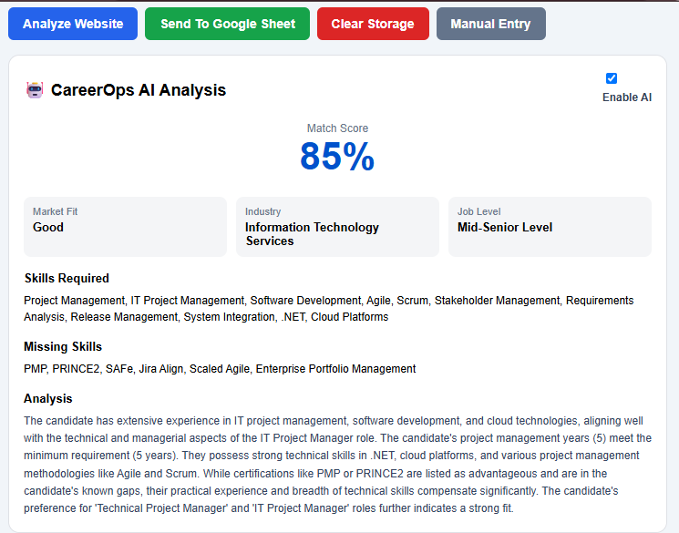
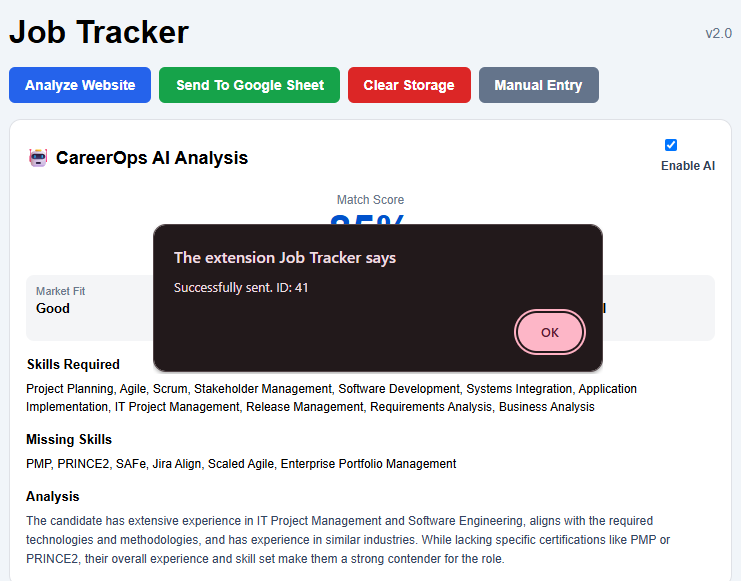
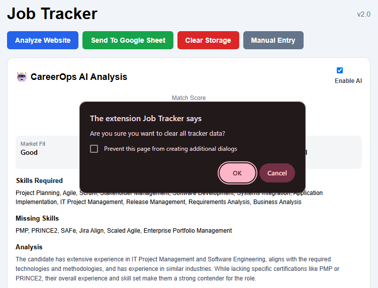
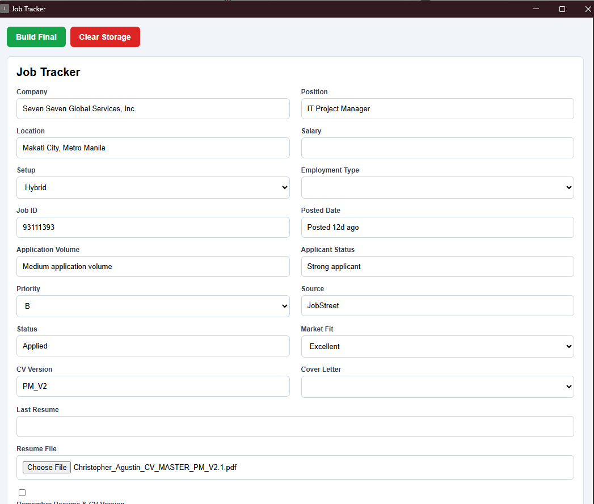
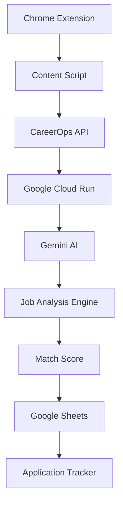
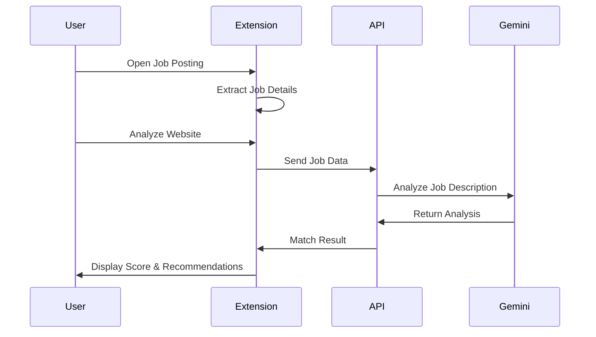

# CareerOps AI – Intelligent Job Application Assistant

## Project Summary

| Category | Details |
|----------|---------|
| **Project Type** | AI-Powered Career Platform |
| **Platform** | Chrome Extension & Cloud-Native Web API |
| **Status** | Active Development |
| **Role** | Product Owner, Technical Project Manager & Full-Stack Developer |
| **Duration** | 2026 – Present |
| **Technologies** | ASP.NET Core 9, C#, Google Gemini AI, Google Cloud Run, Docker, Google Sheets API, JavaScript |
| **Architecture** | Cloud-Native, REST API, AI Integration |
| **Deployment** | Google Cloud Platform |

## Overview

CareerOps AI is a Chrome Extension and Cloud-Native AI Platform designed to help job seekers analyze job opportunities, measure career fit, and make data-driven application decisions.

Instead of manually reviewing every job posting, CareerOps automatically extracts job information from recruitment websites, analyzes the role using Generative AI, compares it against a candidate profile, and generates an AI-powered match score with actionable insights.

The platform was built to solve a common problem faced by professionals applying to hundreds of jobs: **"Is this role worth applying for?"**

---

## Screenshots

### AI-Powered Job Analysis



*Analyze job postings directly from supported recruitment websites using AI. The extension evaluates job requirements, calculates the candidate-to-job match percentage, identifies missing skills, and provides actionable career recommendations.*

---

### Automated Job Tracking



*Automatically capture and synchronize job application details, including company, position, salary, work setup, application status, and resume version to Google Sheets for centralized tracking.*

---

### Clear Application Data



*Reset locally stored job analysis and application data, allowing users to start a new analysis session while maintaining a clean and organized workspace.*

---

### Manual Job Entry



*Manually enter job details for analysis when automatic extraction is unavailable, enabling CareerOps AI to generate match scores and recommendations for any job opportunity.*

---

## Key Features

### AI-Powered Job Analysis

* Extracts job details from recruitment websites
* Identifies required skills
* Detects company industry
* Determines job level and seniority
* Calculates candidate-to-job match percentage
* Identifies missing skills and qualifications

### Career Fit Assessment

Provides:

* Match Percentage
* Market Fit Rating
* Missing Skills Analysis
* Career Alignment Assessment
* Industry Classification

### Chrome Extension Integration

Supports job analysis directly from:

* JobStreet
* Atlassian Careers
* Greenhouse (planned)
* Lever (planned)
* Workday (planned)
* LinkedIn Jobs (planned)

### Automated Job Tracking

Captures:

* Company
* Position
* Salary
* Work Setup
* Employment Type
* Application Status
* Resume Version
* Cover Letter Usage

Stores data automatically in Google Sheets.

### Cloud-Native Architecture

* Serverless backend
* Containerized deployment
* Google Cloud Run hosting
* AI-powered analysis using Gemini

---

### Job Analysis

```text
🟢 Excellent Match
92%

Industry:
IT Consulting

Missing Skills:
• PMP
• SAFe
• PRINCE2
```

### Job Tracking

```text
Company: Accenture
Position: Technical Project Manager
Status: Applied
CV Version: TPM_v3
Market Fit: Excellent
```

---

## Architecture



---

## System Workflow



---

## Technology Stack

### Frontend

* JavaScript (ES6+)
* HTML5
* CSS3
* Chrome Extension Manifest V3

### Backend

* ASP.NET Core 9
* C#
* REST API Architecture

### Artificial Intelligence

* Google Gemini AI
* Prompt Engineering
* Candidate Profile Matching Engine

### Cloud & Infrastructure

* Google Cloud Run
* Google Artifact Registry
* Docker
* WSL2

### Storage & Integration

* Google Sheets API
* Chrome Storage API

### Development Tools

* Visual Studio 2022
* Git
* GitHub
* Postman
* Swagger/OpenAPI

---

## API Example

### Request

```json
{
  "company": "Accenture",
  "position": "Technical Project Manager",
  "url": "https://careers.accenture.com",
  "jobDescription": "Lead software development projects..."
}
```

### Response

```json
{
  "companyIndustry": "IT Consulting",
  "jobLevel": "Senior Technical Project Manager",
  "marketFit": "Excellent",
  "matchPercentage": 92,
  "missingSkills": [
    "PMP",
    "SAFe",
    "PRINCE2"
  ]
}
```

---

## Challenges Solved

### Job Application Prioritization

Problem:

* Hundreds of job applications
* Manual screening is time-consuming
* Difficult to identify high-probability opportunities

Solution:

* Automated AI-driven scoring
* Instant fit assessment
* Prioritized application pipeline

### Resume Version Tracking

Problem:

* Multiple resume versions
* Difficult to track which CV was used

Solution:

* Automatic resume version detection
* Application-level tracking

### Career Decision Support

Problem:

* Unclear role suitability

Solution:

* AI-generated career fit analysis
* Missing skills recommendations
* Match percentage scoring

---

## Future Enhancements

* Resume Analysis Engine
* Cover Letter Generator
* Interview Preparation Assistant
* ATS Score Checker
* Personalized Career Recommendations
* Firestore Integration
* User Authentication
* Analytics Dashboard
* Multi-user SaaS Platform

---

## Project Outcome

CareerOps demonstrates:

* Full-Stack Development
* Cloud-Native Deployment
* AI Integration
* Chrome Extension Development
* REST API Design
* Docker Containerization
* Google Cloud Platform Deployment
* Product Thinking & Solution Architecture

This project showcases the ability to design, develop, deploy, and operate an end-to-end AI-powered SaaS solution from concept to production.
