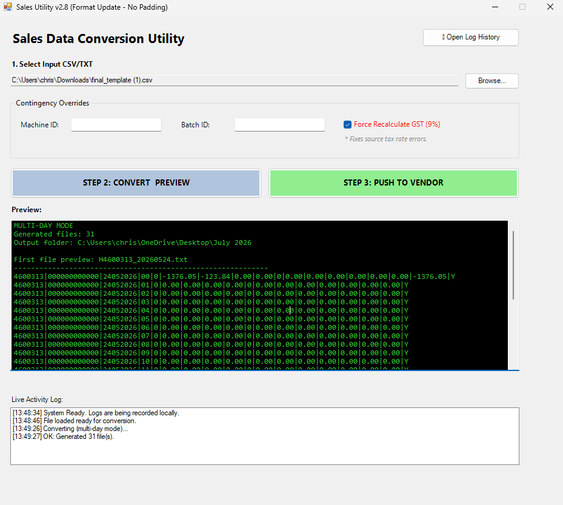
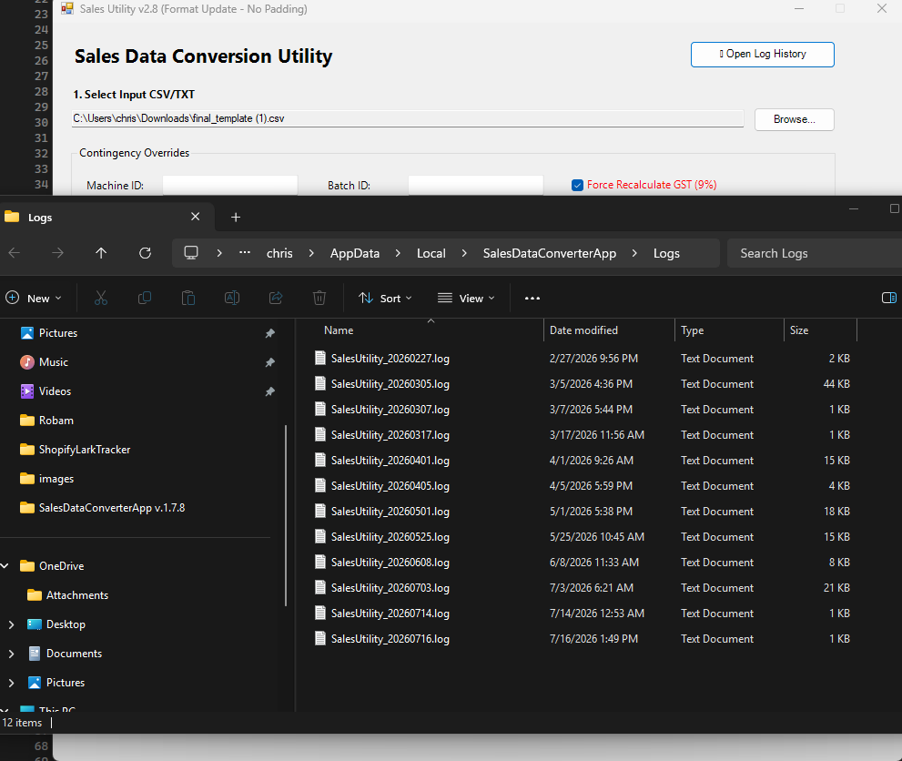

# SalesDataConverterApp

An enterprise Windows desktop application that transforms raw Point-of-Sale (POS) sales data into standardized financial reporting files for secure SFTP delivery and EDI-ready integration.

---

## Project Summary

| Category | Details |
|----------|---------|
| **Project Type** | Enterprise Data Transformation & Integration |
| **Platform** | Windows Desktop (WinForms) |
| **Industry** | Retail & Distribution |
| **Country** | Singapore |
| **Role** | Software Engineer |
| **Project Duration** | 2024 |
| **Status** | Completed |
| **Technology Stack** | C#, .NET Framework, WinForms, SFTP, CSV Processing, File I/O |
| **Services Provided** | Data Transformation, ETL Processing, SFTP Integration, EDI Preparation, Business Process Automation |

---

## Overview

SalesDataConverterApp is an enterprise integration utility developed to automate the transformation of raw Point-of-Sale (POS) sales data into standardized financial reporting files.

The application eliminates manual data processing by converting inconsistent sales exports into validated, business-ready output files that can be securely transmitted to downstream finance and ERP systems through SFTP.

Designed with EDI compatibility in mind, the solution serves as a pre-processing layer for enterprise retail integrations.

---

## Screenshots

### Main Application Dashboard



*Main application interface providing a guided workflow for selecting source files, configuring processing options, previewing converted output, and initiating secure SFTP file transfers.*

---

### Processing Logs & Operational Monitoring



*Real-time processing logs displaying the conversion lifecycle, validation results, SFTP connection status, upload progress, retry attempts, and operational messages to support monitoring, troubleshooting, and auditability.*

---

## 🚀 Key Features

### 1. Automated Sales Data Transformation Engine
- Converts raw CSV / pipe-delimited POS exports into structured output files
- Handles inconsistent vendor formats (Report Pundit / Shopify App exports)
- Auto-detects headers and column mapping
- Generates standardized **24-hour sales breakdown (00–23)**

---

### 2. Data Normalization & Business Rules
- Enforces fixed-format output required by downstream financial systems
- Supports:
  - Machine ID override (contingency control)
  - Batch ID override
  - GST recalculation (9% enforced rule)
- Normalizes payment breakdown:
  - Cash, NETS, Visa, MasterCard, Amex, Voucher, Others
- Ensures GST Registered flag standardization (`Y / N` normalization)

---

### 3. Multi-Day Batch Processing
- Automatically detects multiple business dates in a single file
- Supports:
  - Single-day processing mode
  - Month-end / backfill multi-day processing mode
- Generates separate output files per business date:


---

### 4. Secure SFTP File Delivery
- Direct upload to vendor SFTP server
- Config-driven connection (no hardcoded credentials)
- Robust transfer mechanism:
- Temporary upload staging file
- Rename-based finalization
- Retry logic for “resource busy / file in progress” errors
- File integrity validation (size check before final commit)
  
---

### 5. EDI-Ready Output Design (NEW)
This system is designed with **EDI compatibility in mind**, enabling integration with enterprise systems such as ERP, finance, and retail consolidation platforms.

- Produces structured, deterministic output format suitable for:
- Flat-file EDI mapping
- ERP ingestion pipelines
- Middleware translation layers (e.g., API / ESB / iPaaS)
- Ensures:
- Fixed field ordering
- Predictable delimiter structure (`|`)
- Consistent numeric formatting (F2 precision)
- Deterministic daily transaction output

### EDI Integration Capability (Planned/Extendable)
- Can be extended to support:
- EDI 850 / 810 / custom financial message formats
- XML / JSON transformation layer
- Middleware integration (Azure Integration Services / Mulesoft / Boomi)
- Acts as a **pre-EDI transformation layer** for retail finance systems

---

### 6. Logging & Operational Monitoring
- Centralized local logging system (`FileLogger`)
- Tracks:
- File selection
- Conversion lifecycle
- SFTP connection status (GOOD / NOT GOOD)
- Upload retries and failures
- Real-time UI status tracking for operators

---

### 7. User Interface (WinForms Operational Tool)
- Step-based workflow:
1. Select input file
2. Convert & preview output
3. Push to SFTP / EDI pipeline
- Live preview for validation
- Override controls for operational exceptions
- Progress tracking for long-running operations

---

## 🏗️ Architecture Overview

                ┌──────────────────────────────┐
                │   Report Pundit (Shopify)    │
                │  - Daily Sales Export File   │
                └──────────────┬───────────────┘
                               │
                               ▼
                ┌──────────────────────────────┐
                │   Manual / Email / Drive     │
                │   (Raw CSV / Pipe File)      │
                └──────────────┬───────────────┘
                               │
                               ▼
        ┌────────────────────────────────────────────┐
        │      SalesDataConverterApp (WinForms)      │
        │────────────────────────────────────────────│
        │  UI Layer                                  │
        │   - File Selection                         │
        │   - Overrides (Machine / Batch / GST)      │
        │   - Preview Panel                          │
        │                                            │
        │  ConverterEngine (ETL Logic)               │
        │   - Normalize Columns                      │
        │   - 24-hour Data Completion                │
        │   - GST Recalculation                      │
        │   - Multi-day Aggregation                  │
        │                                            │
        │  Output Formatter (EDI-ready Flat File)    │
        │   - Fixed structure pipe-delimited         │
        │   - Deterministic formatting               │
        └──────────────┬─────────────────────────────┘
                       │
                       ▼
        ┌────────────────────────────────────────────┐
        │   Integration Layer                        │
        │   - SFTP Upload Service                   │
        │   - Retry + Recovery Logic                │
        │   - File Integrity Validation             │
        └──────────────┬────────────────────────────┘
                       │
                       ▼
        ┌────────────────────────────────────────────┐
        │   Vendor / Downstream Systems             │
        │   - POS Reconciliation                    │
        │   - Finance Reporting (GTO)              │
        │   - ERP / EDI Consumption Layer          │
        └────────────────────────────────────────────┘


---

## 🔐 Integration & Security Features

- Config-driven credentials (App.config)
- Optional host key validation (SHA256 fingerprint support)
- Secure SFTP transfer with retry & fallback logic
- Temporary upload file strategy:
  - Upload → `.uploading.<GUID>`
  - Validate → rename to final file
- Prevents partial or corrupted file delivery

---

## 📁 Output File Format

Example filename: H4600313_20260121.txt


Structure:
- `H` = system prefix
- `4600313` = Machine ID
- `20260121` = Business date (YYYYMMDD)

---

## ⚙️ Configuration (App.config)

```xml
<appSettings>
  <add key="Sftp.Host" value="your-server-ip" />
  <add key="Sftp.Port" value="22" />
  <add key="Sftp.Username" value="your-login" />
  <add key="Sftp.Password" value="your-password" />
  <add key="Sftp.RemoteDirectory" value="/POS/46/4600313" />

  <add key="Defaults.MachineId" value="4600313" />
  <add key="Defaults.BatchId" value="000000000000" />
  <add key="Defaults.ForceGst" value="true" />

  <add key="App.Version" value="2.7" />
</appSettings>
