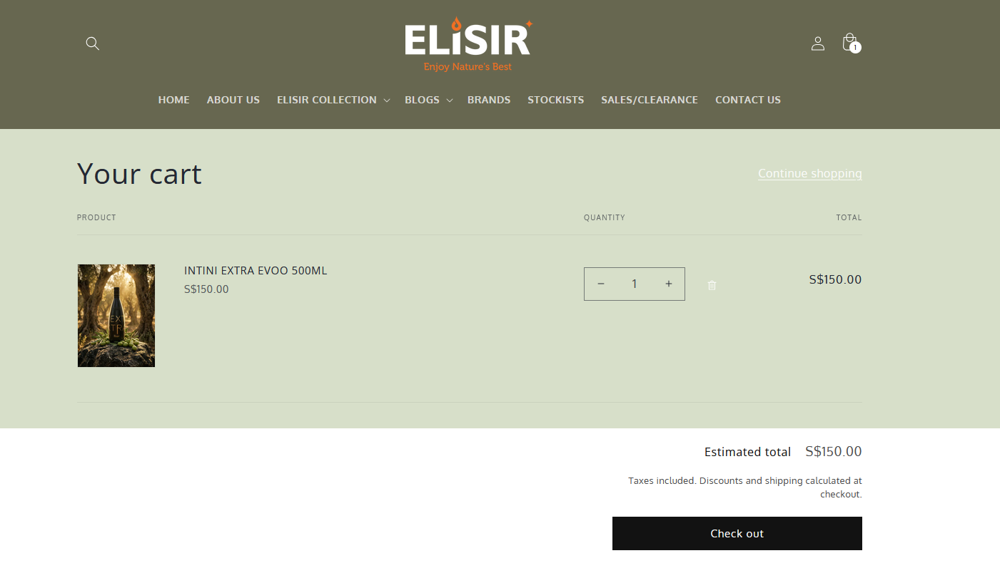

## Project Summary

| Category | Details |
|----------|---------|
| **Website** | https://elisir.world/ |
| **Industry** | Health & Wellness |
| **Country** | Singapore |
| **Platform** | Shopify |
| **Role** | IT Project Manager |
| **Project Duration** | 2024 |
| **Status** | Completed |
| **Services Provided** | Project Planning, Requirements Gathering, Stakeholder Management, Technical Coordination, Shopify Implementation Management, UAT Coordination, Deployment Planning |
| **Technology Stack** | Shopify, Jira, Confluence, Microsoft Office, Google Workspace |

---

## Project Overview

Elisir is a Shopify-based health and wellness eCommerce platform. The project involved planning and coordinating Shopify implementation activities while aligning business objectives with technical delivery.

---

## My Role

As the **IT Project Manager**, I coordinate project planning, stakeholder communication, requirements management, technical delivery, and project governance to support successful implementation.

---

## Key Responsibilities

- Project planning
- Requirements gathering
- Stakeholder management
- Technical coordination
- Sprint planning
- UAT coordination
- Delivery management

---

## Key Features Delivered

- Shopify implementation planning
- Requirements documentation
- Technical coordination
- UAT planning
- Deployment coordination

---

## Key Contributions

- Align business objectives with technical implementation.
- Facilitate communication between stakeholders and development teams.
- Manage project delivery using structured project management practices.
- Support successful project execution through planning and coordination.

---

## Technologies

- Shopify
- Jira
- Confluence
- Google Workspace
- Microsoft Office

---

## Screenshots

### Homepage

> 

*Landing page showcasing featured products and promotional banners.*

### Collection Page

> 

*Product collection page displaying categorized products with filtering and browsing capabilities.*

### Product Details

> 

*Example product page with product information and purchasing options.*

### Shopping Cart

> 

*Shopping cart and checkout preparation.*

### Mobile View

> 

*Responsive mobile experience.*

---

## Challenges & Solutions

### Challenge

Coordinate project activities across business and technical teams while maintaining project timelines and delivery quality.

### Solution

Apply structured project management practices, regular stakeholder communication, and delivery planning to ensure successful implementation.

---

## Disclaimer

Project information is presented for portfolio purposes only. Proprietary business information has been omitted.
