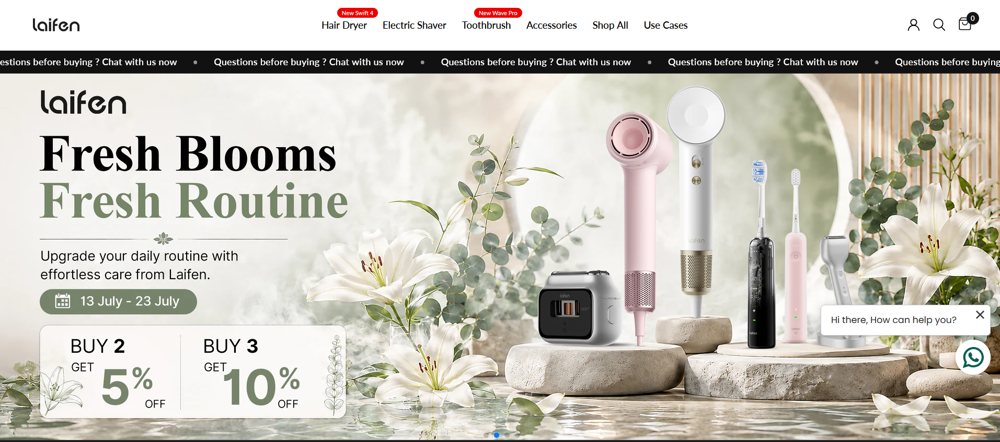
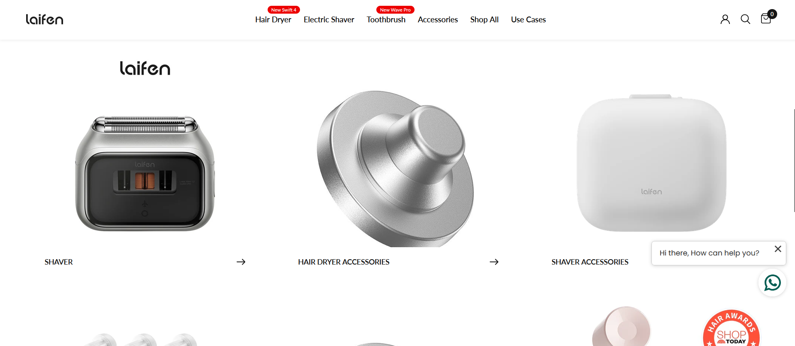
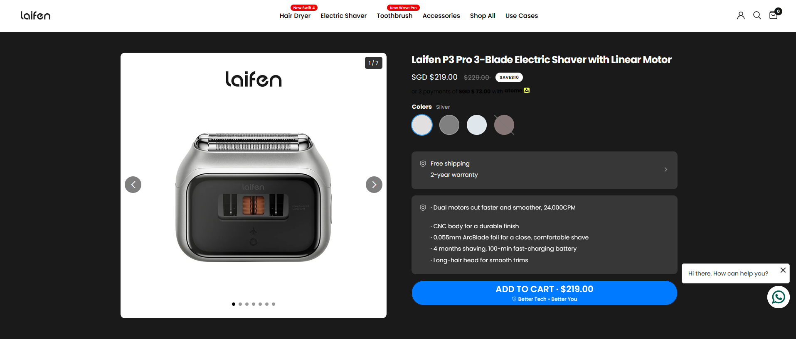
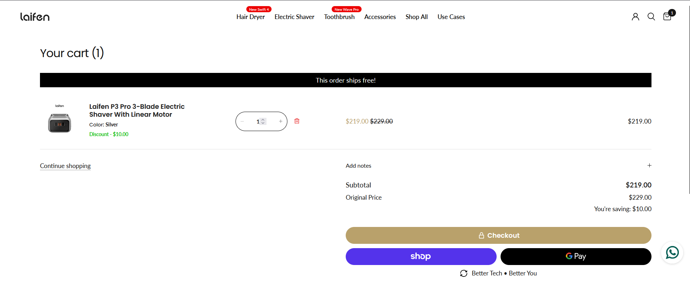
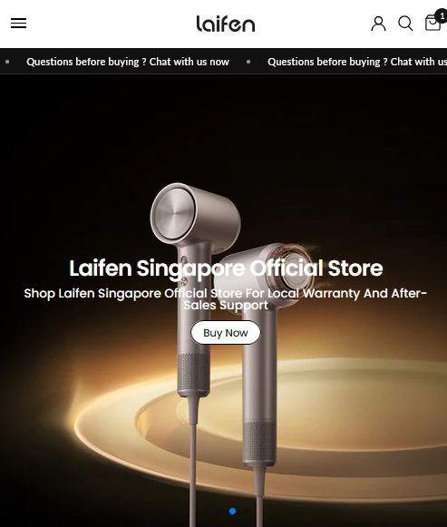

## Project Summary

| Category | Details |
|----------|---------|
| **Website** | https://sg.laifentech.com/ |
| **Industry** | Consumer Electronics |
| **Country** | Singapore |
| **Platform** | Shopify |
| **Role** | IT Specialist |
| **Project Duration** | February 2025 – Present |
| **Status** | Ongoing |
| **Services Provided** | Shopify Development, Theme Customization, Website Maintenance, Feature Enhancements, Technical Support |
| **Technology Stack** | Shopify, Liquid, HTML, CSS, JavaScript |

---

## Project Overview

Laifen Singapore is a Shopify-based eCommerce platform for premium consumer electronics. The project involves website maintenance, feature implementation, and technical enhancements supporting business operations.

---

## My Role

As the **IT Specialist**, I maintain and improve the Shopify storefront through feature implementation, theme customization, technical support, and website optimization.

---

## Key Responsibilities

- Website maintenance
- Theme customization
- Shopify enhancements
- Production support
- Technical troubleshooting
- Business support

---

## Key Features Delivered

- Homepage enhancements
- Product page customization
- Collection improvements
- Theme customization
- Responsive improvements
- Bug fixes

---

## Key Contributions

- Deliver continuous improvements to the Shopify storefront.
- Translate business requirements into maintainable Shopify solutions.
- Support daily business operations through technical enhancements.

---

## Technologies

- Shopify
- Shopify Liquid
- HTML
- CSS
- JavaScript

---

## Screenshots

### Homepage

> 

*Landing page showcasing featured products and promotional banners.*

### Collection Page

> 

*Product collection page displaying categorized products with filtering and browsing capabilities.*

### Product Details

> 

*Example product page with product information and purchasing options.*

### Shopping Cart

> 

*Shopping cart and checkout preparation.*

### Mobile View

> 

*Responsive mobile experience.*

---

## Challenges & Solutions

### Challenge

Maintain website quality while delivering ongoing feature requests.

### Solution

Apply structured development, testing, and deployment practices to ensure reliable releases.

---

## Disclaimer

Project information is presented for portfolio purposes only.
