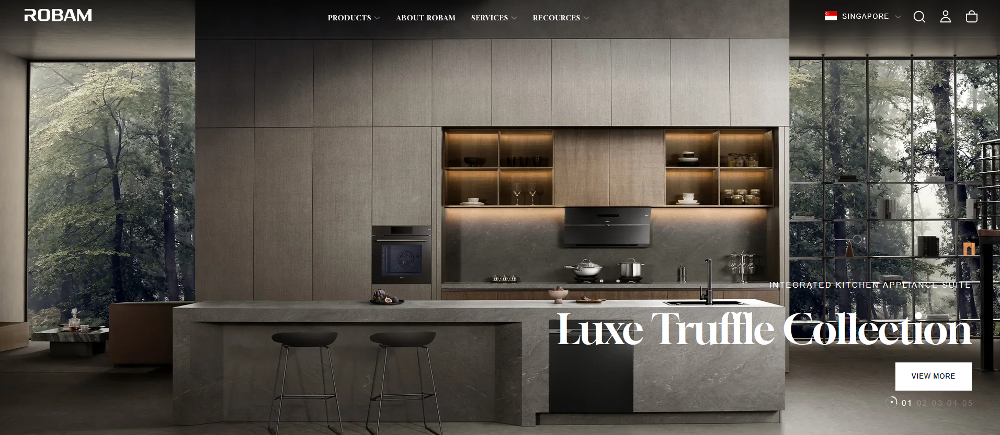
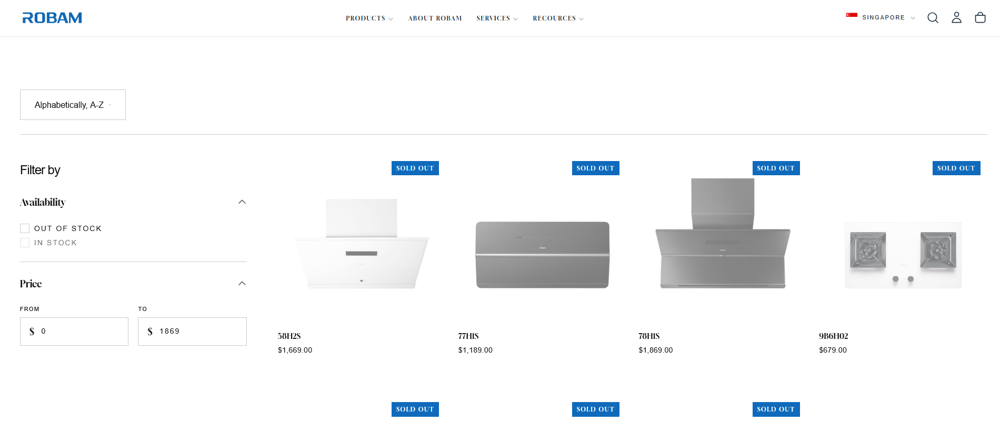
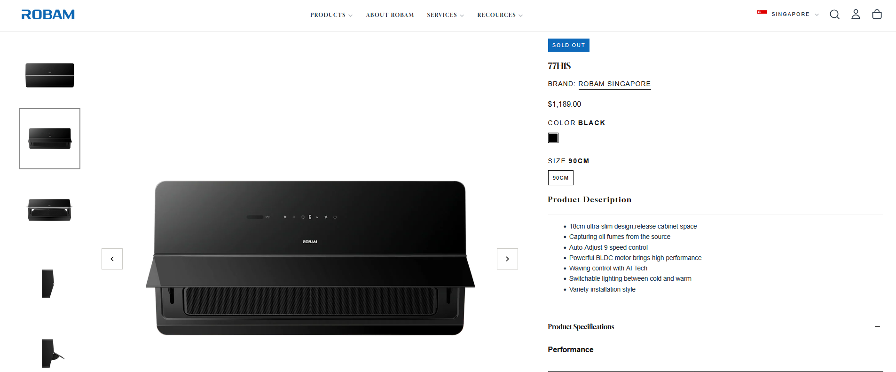
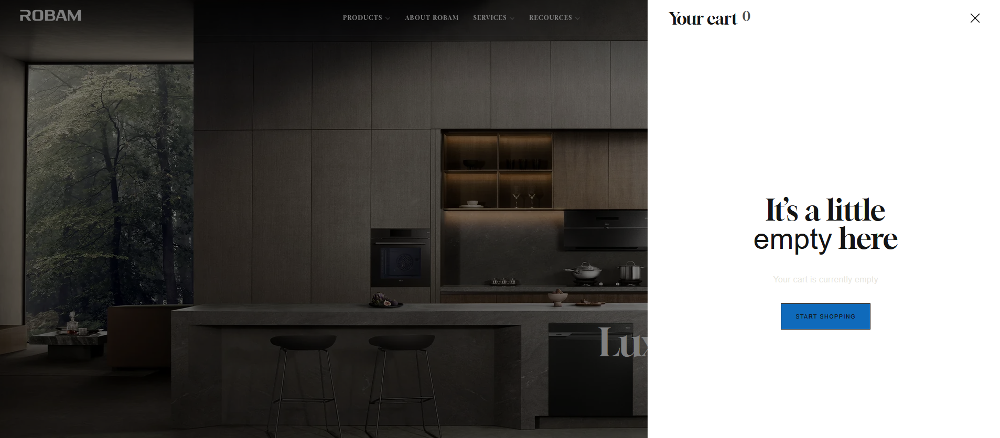
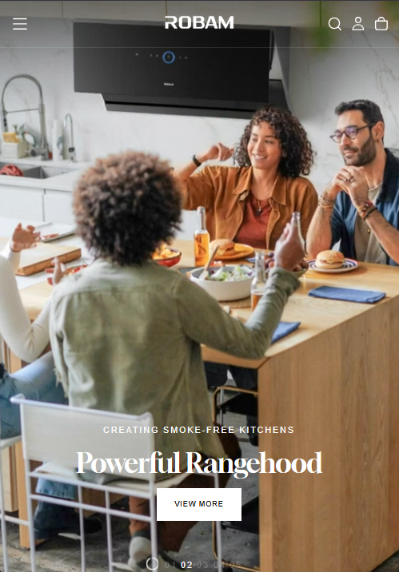

## Project Summary

| Category | Details |
|----------|---------|
| **Website** | https://robamsg.com/ | https://robam.sg/ |
| **Industry** | Kitchen Appliances |
| **Country** | Singapore |
| **Platform** | Shopify |
| **Role** | Technical Consultant |
| **Project Duration** | June 2026 – Present |
| **Status** | Ongoing |
| **Services Provided** | Technical Consulting, Requirements Gathering, Shopify Development, Theme Customization, Website Implementation, Deployment, Technical Documentation |
| **Technology Stack** | Shopify, Liquid, HTML, CSS, JavaScript |

---

## Project Overview

Robam Singapore engaged me as a Technical Consultant to plan, implement, and customize its Shopify website. The engagement covered technical consultation, Shopify implementation, deployment, and post-launch support.

---

## My Role

As the **Technical Consultant**, I translate business requirements into technical solutions, provide implementation recommendations, customize the Shopify storefront, and manage project delivery through deployment.

---

## Key Responsibilities

- Technical consultation
- Requirements gathering
- Shopify implementation
- Theme customization
- Website deployment
- Client support

---

## Key Features Delivered

- Shopify storefront implementation
- Homepage customization
- Product page customization
- Theme enhancements
- Website deployment
- Technical documentation

---

## Key Contributions

- Bridge business requirements with technical implementation.
- Recommend practical Shopify solutions aligned with business goals.
- Deliver a production-ready Shopify storefront.
- Provide technical guidance throughout the project lifecycle.

---

## Technologies

- Shopify
- Shopify Liquid
- HTML
- CSS
- JavaScript

---

## Screenshots

### Homepage

> 

*Landing page showcasing featured products and promotional banners.*

### Collection Page

> 

*Product collection page displaying categorized products with filtering and browsing capabilities.*

### Product Details

> 

*Example product page with product information and purchasing options.*

### Shopping Cart

> 

*Shopping cart and checkout preparation.*

### Mobile View

> 

*Responsive mobile experience.*

---

## Challenges & Solutions

### Challenge

Implement a Shopify website that reflects the client's business requirements while maintaining a clean and scalable solution.

### Solution

Conduct requirement discussions, recommend suitable implementation approaches, and deliver incremental enhancements throughout the project.

---

## Disclaimer

Project information is presented for portfolio purposes only.
