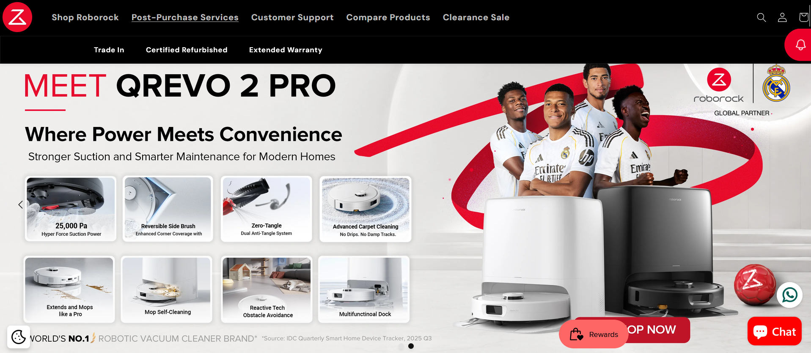
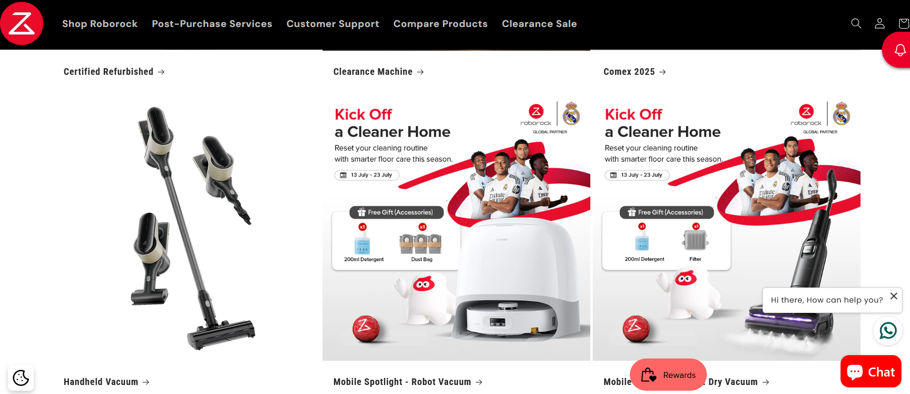
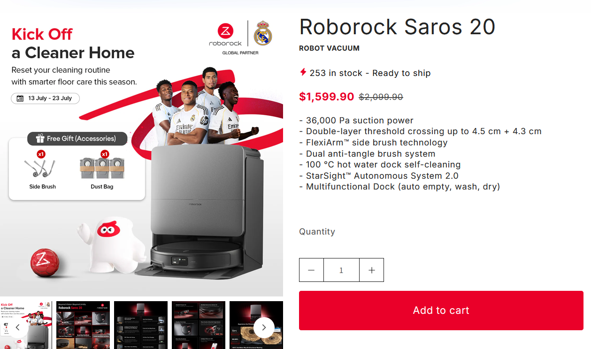
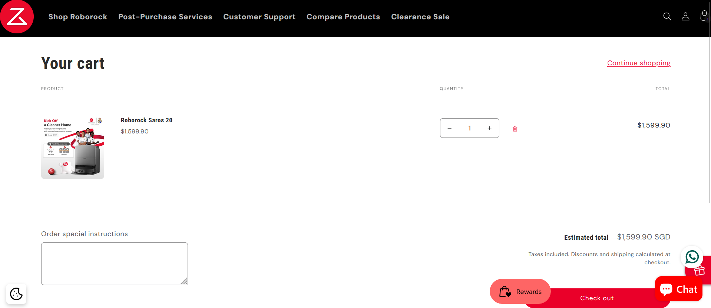
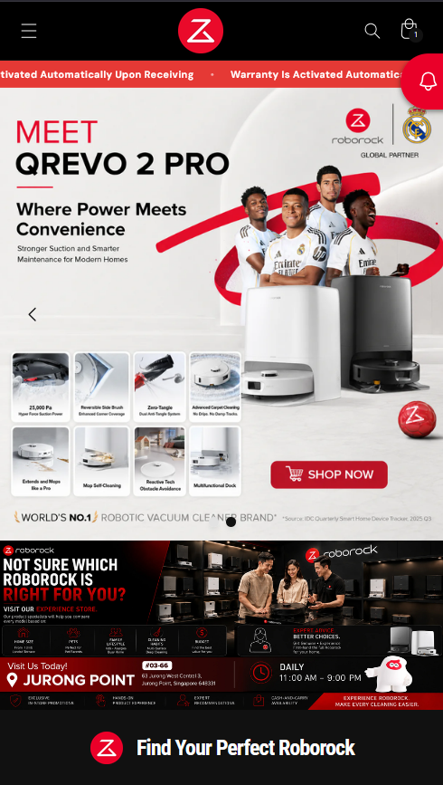

# Roborock Singapore

## Project Summary

| Category | Details |
|----------|---------|
| **Website** | https://www.roborock.sg/ |
| **Industry** | Consumer Electronics |
| **Country** | Singapore |
| **Platform** | Shopify |
| **Role** | IT Specialist |
| **Project Duration** | February 2025 – Present |
| **Status** | Ongoing |

---

## Project Overview

Roborock Singapore is the official Shopify eCommerce platform for Roborock products in Singapore. The website supports online product sales, marketing campaigns, and customer engagement through a modern Shopify storefront.

---

## My Role

As the **IT Specialist**, I maintain and enhance the Shopify storefront by implementing new features, customizing themes, resolving technical issues, supporting business operations, and coordinating website improvements with internal stakeholders.

---

## Key Responsibilities

- Maintain the Shopify storefront
- Develop and customize Shopify themes and sections
- Implement new website features and enhancements
- Troubleshoot and resolve production issues
- Configure Shopify applications and store settings
- Support business and marketing requirements
- Improve website usability and performance

---

## Key Features Delivered

- Homepage enhancements
- Product page customization
- Collection page improvements
- Theme customization
- Promotional landing pages
- Responsive design improvements
- Bug fixes
- Shopify application configuration

---

## Key Contributions

- Support continuous improvement of the Shopify storefront.
- Translate business requirements into technical solutions.
- Deliver production-ready enhancements aligned with business priorities.
- Improve website stability through ongoing maintenance and issue resolution.
- Provide technical support for day-to-day Shopify operations.

---

## Technologies

- Shopify
- Shopify Liquid
- HTML
- CSS
- JavaScript

---

## Screenshots

### Homepage

> 

*Landing page showcasing featured products and promotional banners.*

### Collection Page

> 

*Product collection page displaying categorized products with filtering and browsing capabilities.*

### Product Details

> 

*Example product page with product information and purchasing options.*

### Shopping Cart

> 

*Shopping cart and checkout preparation.*

### Mobile View

> 

*Responsive mobile experience.*

---

## Challenges & Solutions

### Challenge

Business stakeholders regularly request new features while ensuring the storefront remains stable and available.

### Solution

Implement enhancements incrementally, perform testing before deployment, and coordinate closely with stakeholders to minimize operational impact.

---

## Disclaimer

This project is presented for portfolio purposes only. Proprietary source code, business logic, and confidential client information have been excluded.
