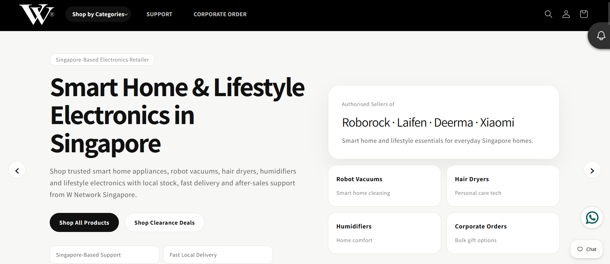
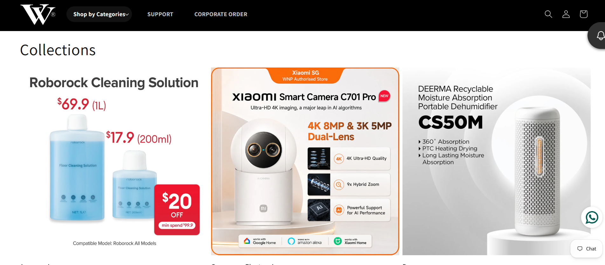
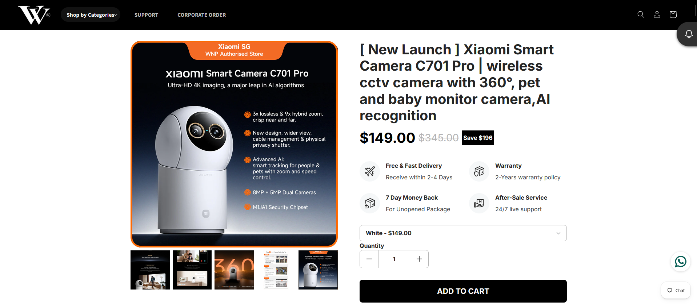
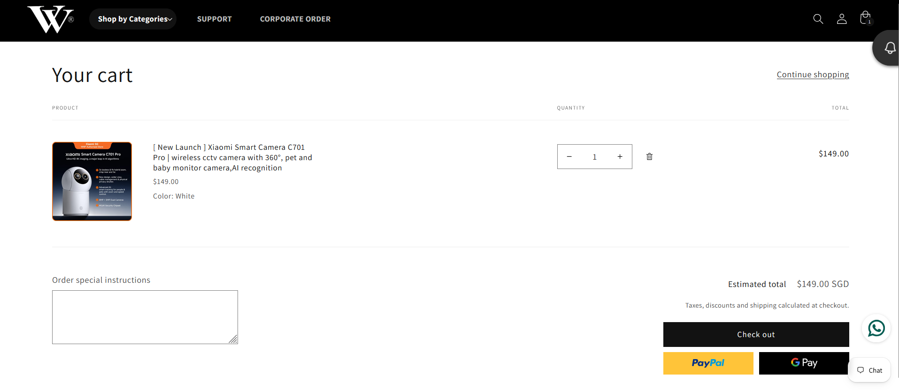

## Project Summary

| Category | Details |
|----------|---------|
| **Website** | https://wnetwork.sg/ |
| **Industry** | Retail & Distribution |
| **Country** | Singapore |
| **Platform** | Shopify |
| **Role** | IT Specialist |
| **Project Duration** | February 2025 – Present |
| **Status** | Ongoing |
| **Services Provided** | Shopify Development, Theme Customization, Website Maintenance, Feature Enhancements, Technical Support |
| **Technology Stack** | Shopify, Liquid, HTML, CSS, JavaScript |

---

## Project Overview

W Network Singapore operates multiple consumer brands through its Shopify platform. The project focuses on website maintenance, feature enhancements, and continuous improvements supporting business operations.

---

## My Role

As the **IT Specialist**, I maintain and enhance the Shopify storefront by implementing new functionality, supporting business users, resolving technical issues, and improving the overall customer experience.

---

## Key Responsibilities

- Shopify website maintenance
- Theme customization
- Feature enhancements
- Production support
- Technical troubleshooting
- Store configuration
- Business support

---

## Key Features Delivered

- Homepage improvements
- Product page enhancements
- Navigation improvements
- Theme customization
- Bug fixes
- Mobile responsiveness improvements

---

## Key Contributions

- Support business operations through continuous website enhancements.
- Implement requested features while maintaining website stability.
- Resolve production issues efficiently.
- Improve customer experience through ongoing optimizations.

---

## Technologies

- Shopify
- Shopify Liquid
- HTML
- CSS
- JavaScript

---

## Screenshots

### Homepage

> 

*Landing page showcasing featured products and promotional banners.*

### Collection Page

> 

*Product collection page displaying categorized products with filtering and browsing capabilities.*

### Product Details

> 

*Example product page with product information and purchasing options.*

### Shopping Cart

> 

*Shopping cart and checkout preparation.*

### Mobile View

> 

*Responsive mobile experience.*

---

## Challenges & Solutions

### Challenge

Support continuous business requests while minimizing disruption to the production environment.

### Solution

Implement controlled enhancements with testing and validation before deployment.

---

## Disclaimer

Project information is presented for portfolio purposes only.
