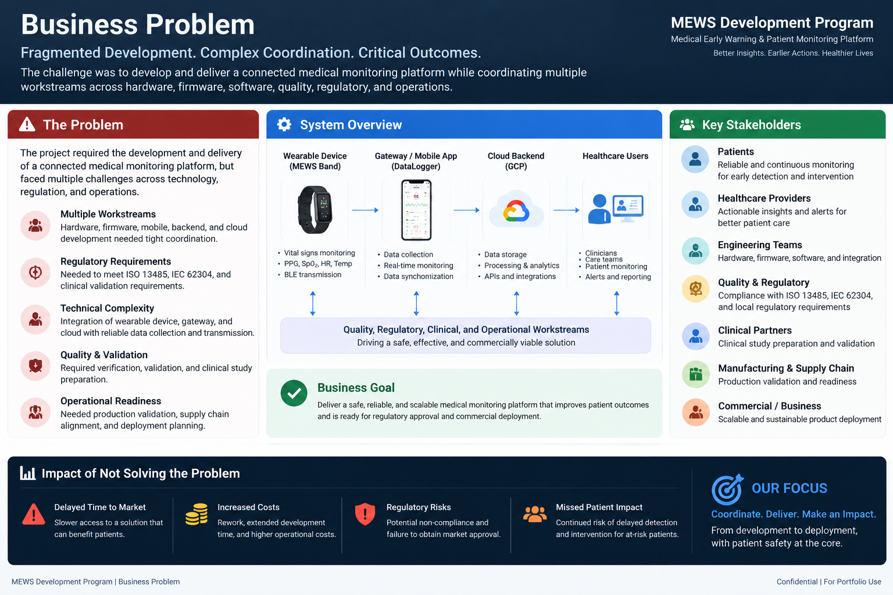

# Business Problem

The project required the development and delivery of a connected medical monitoring platform combining wearable hardware, firmware, mobile software, backend services, cloud infrastructure, and clinical workflows.

The business challenge was not only product development, but coordinating multiple technical and operational workstreams while meeting quality, validation, regulatory, and manufacturing requirements.

## Key Challenges

| Area | Business / Delivery Challenge |
|---|---|
| Product | Coordinate development of a medical monitoring solution across multiple components |
| Hardware | Align wearable and gateway development with software requirements |
| Software | Coordinate mobile, backend, cloud, and integration workstreams |
| Data | Support reliable collection and transmission of patient monitoring data |
| Quality | Align development activities with a regulated quality management environment |
| Validation | Coordinate verification, validation, and clinical preparation |
| Operations | Prepare the product and supporting processes for production and deployment |

## PM Focus

My role was to translate the broader business and product objectives into coordinated delivery across engineering, software, quality, clinical, regulatory, and operations teams.

## Evidence

### Business Problem

[View PDF version](./Business_Problem.pdf)

## Related Project

[← Back to MEWS Case Study](../README.md)
