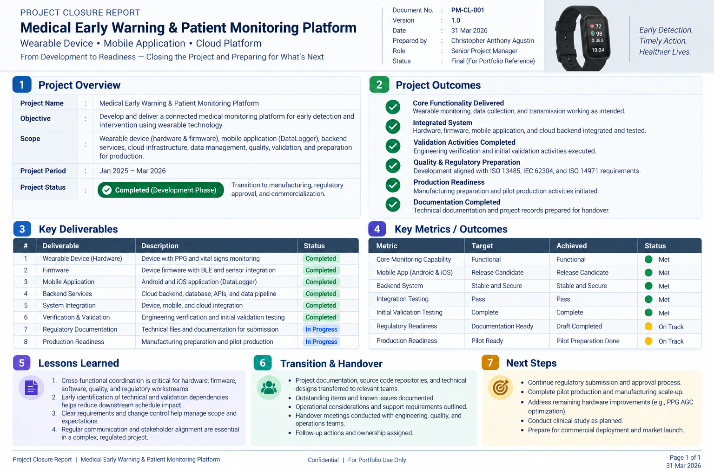

# Closure

Project closure focused on confirming delivery outcomes, documenting lessons learned, completing transition activities, and establishing follow-up actions.

## Closure Summary

The project moved through development, integration, quality, validation, and operational readiness activities, with closure focused on confirming deliverables, outstanding items, ownership, and next steps.

| Area | Closure Focus |
|---|---|
| Deliverables | Confirm completed project outputs and remaining items |
| Quality | Confirm required quality and compliance activities |
| Validation | Review verification, validation, and UAT outcomes |
| Transition | Transfer responsibilities, documentation, and operational knowledge |
| Lessons Learned | Capture delivery issues, improvements, and recommendations |
| Follow-up | Identify remaining actions, risks, and future improvements |

## Lessons Learned

- Cross-functional coordination is critical when hardware, firmware, software, quality, and operational workstreams are interdependent.
- Early identification of technical and validation dependencies helps reduce downstream schedule impact.
- Delivery decisions should balance product requirements, technical constraints, quality expectations, and operational readiness.
- Clear ownership and communication are essential during transition and closure.

## Transition & Handover

Closure included coordination of project documentation, technical knowledge, outstanding actions, operational considerations, and ownership transition to the appropriate teams.

## Evidence

### Project Closure

[View Project Closure Report](./Project_Closure_Report.pdf)

## Related Project

[← Back to MEWS Case Study](../README.md)
