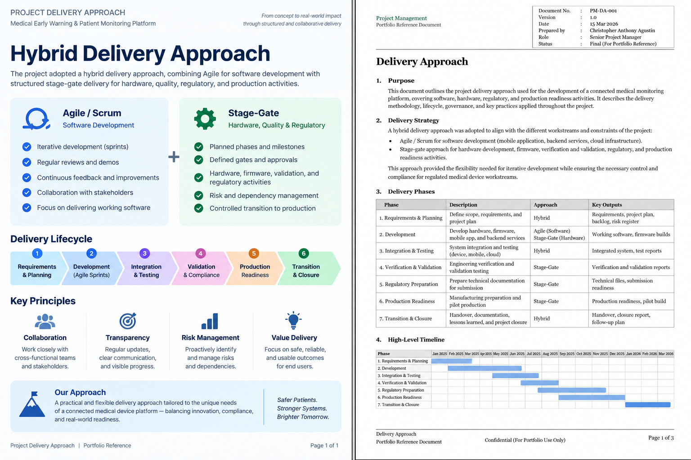

# Delivery & Approach

The project used a **Hybrid Agile / Waterfall** delivery approach. Software delivery followed Agile / Scrum practices, while hardware, quality, validation, clinical, regulatory, and production activities followed planned stages, gates, and dependencies.

## Delivery Lifecycle

The delivery approach covered requirements, planning, development, integration, verification and validation, UAT, readiness, transition, and follow-up activities.

## Evidence

### Delivery Approach

[View Delivery Approach](./delivery-approach.pdf)

## Related Project

[← Back to MEWS Case Study](../README.md)
