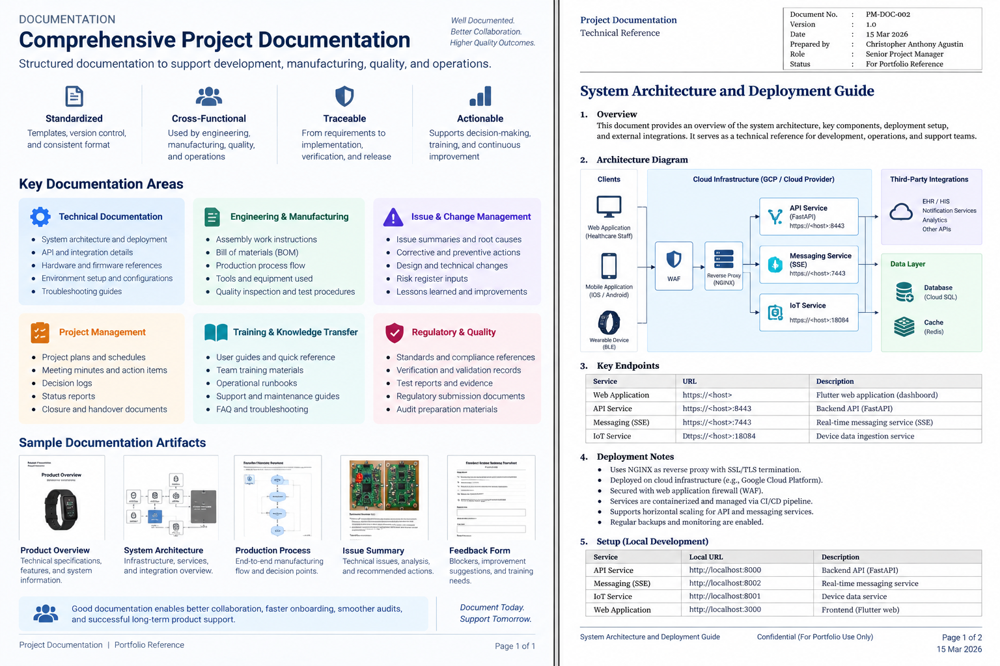

# Documentation

Project documentation supported software development, hardware and manufacturing activities, quality, validation, operations, and cross-functional project delivery.

## Documentation Areas

| Area | Purpose |
|---|---|
| Project Management | Planning, schedules, status, decisions, and coordination |
| Requirements | Product and technical requirements, scope, and traceability |
| Technical | Architecture, interfaces, deployment, and technical references |
| Engineering & Manufacturing | Work instructions, assembly, production flow, and technical procedures |
| Quality & Validation | Quality records, verification, validation, and compliance documentation |
| Issues & Changes | Problem identification, impact, corrective actions, and improvements |
| Handover & Operations | Knowledge transfer, support information, and transition activities |

## Documentation Lifecycle

```text
Capture
   ↓
Define
   ↓
Review
   ↓
Approve
   ↓
Maintain
   ↓
Release / Use
   ↓
Archive / Transition
```

## Evidence

### Project Planning


[View Documentation](./documentation.PDF)

## Related Project

[← Back to MEWS Case Study](../README.md)
