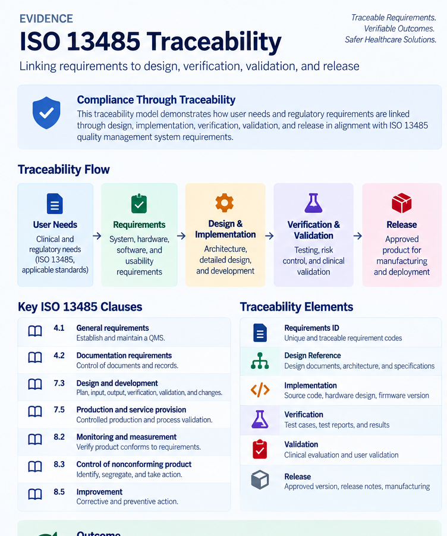

# Evidence

## ISO 13485 & Requirements Traceability

The project operated within a regulated medical-technology environment, with requirements, design, verification, validation, quality, and release activities connected through traceability.

### Traceability

[View ISO 13485 Traceability Reference](./ISO_13485_Traceability_Reference.pdf)

### ISO 13485 Certification

[View Certification Verification](https://www.iafcertsearch.org/certification/y0HvGMKKvaQMQmOFwNGC4DDo)

## Related Project

[← Back to MEWS Case Study](../README.md)
