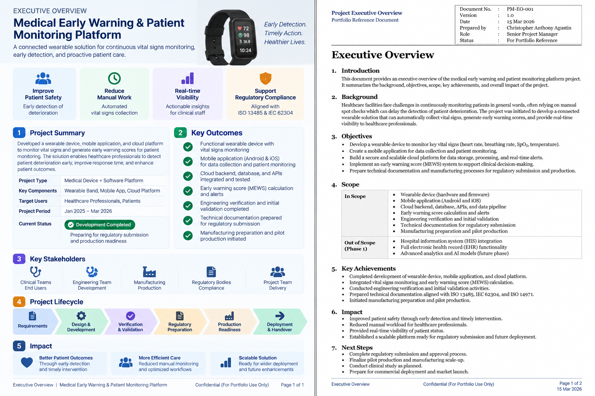

# Executive Overview

A concise overview of the Medical Early Warning & Patient Monitoring Platform, covering its business objective, scope, delivery status, stakeholders, key management priorities, and overall outcome.

## Evidence

### Executive Overview

[View Executive Overview](./executive-overview.pdf)

## Related Project

[← Back to MEWS Case Study](../README.md)
