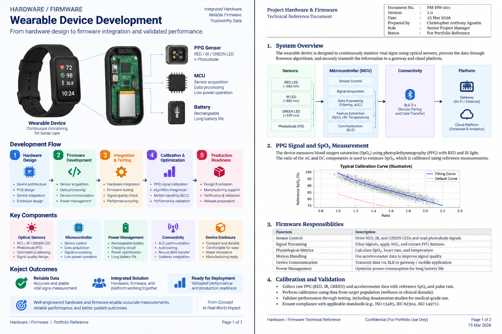

# Hardware / Firmware

Hardware and firmware delivery covered wearable device development, sensor integration, device communication, signal acquisition, and coordination with verification and validation activities.

## Hardware Scope

| Area | Delivery Focus |
|---|---|
| Wearable Device | Device enclosure, PCB assemblies, sensors, battery, charging, and physical interfaces |
| PPG / Sensors | Optical sensing configuration, LED / photodiode positioning, and signal quality considerations |
| Connectivity | Device-to-gateway communication and reliable transfer of measurement data |
| Firmware | Sensor acquisition, device communication, data handling, and firmware integration |
| Manufacturing | Assembly requirements, production considerations, and hardware readiness |
| Verification | Hardware, firmware, integration, and performance testing |

## Firmware & Sensor Integration

Firmware development was closely coordinated with the hardware configuration and sensor characteristics.

Key considerations included:

- PPG signal acquisition and sensor configuration
- LED and photodiode positioning
- Sensor-specific calibration requirements
- Device motion / accelerometer data
- Communication between wearable hardware and the supporting platform
- Hardware and firmware dependencies affecting verification and validation

The sensor configuration influenced measurement performance, making hardware, firmware, algorithm integration, and validation activities interdependent.

## Technical Delivery Flow

```text
Hardware Design
   ↓
Sensor / Component Integration
   ↓
Firmware Development
   ↓
Signal Acquisition
   ↓
Integration Testing
   ↓
Calibration / Optimization
   ↓
Verification & Validation
   ↓
Production Readiness
```

## PM Responsibilities

My role included coordinating hardware and software workstreams, making technical dependencies visible, tracking issues affecting delivery, and aligning engineering activities with verification, validation, quality, and production-readiness requirements.

## Key Technical Considerations

| Topic | PM / Engineering Focus |
|---|---|
| Sensor Configuration | Ensure hardware configuration is understood before performance validation |
| PPG Performance | Coordinate sensor, firmware, and calibration dependencies |
| Integration | Align device, firmware, gateway, and platform interfaces |
| Technical Issues | Track hardware findings and their impact on schedule and validation |
| Verification | Coordinate evidence required to demonstrate expected performance |
| Readiness | Align engineering completion with manufacturing and downstream activities |

## Evidence

### Hardware & Firmware Integration


[View Hardware & Firmware Integration Reference](./hardware-firmware.pdf)

## Related Project

[← Back to MEWS Case Study](../README.md)
