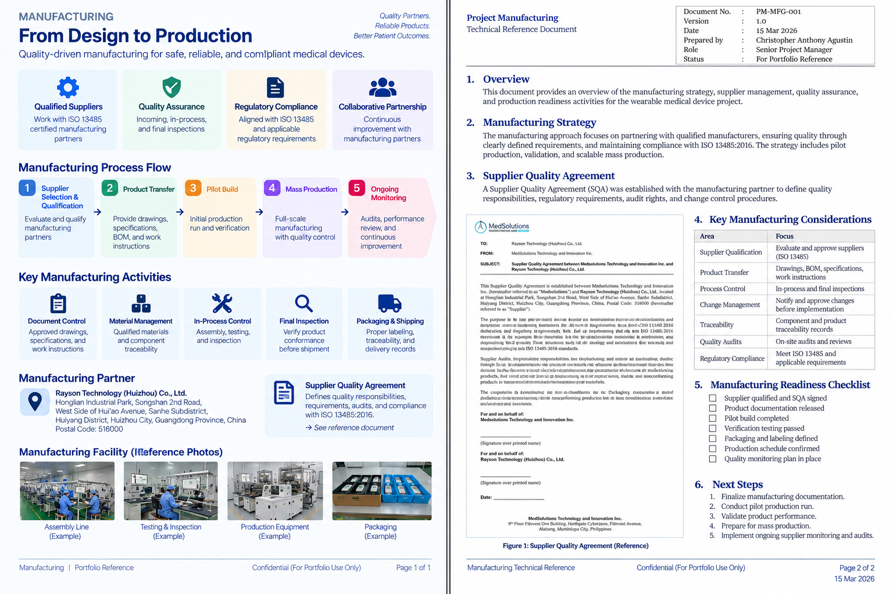

# Manufacturing

Manufacturing activities covered supplier coordination, product transfer, pilot builds, quality controls, production readiness, and ongoing supplier performance management.

## Manufacturing Approach

The manufacturing workstream was coordinated with engineering, quality, validation, and project delivery activities to support a controlled transition from development into production.

## Evidence

### Manufacturing & Supplier Quality

[View Manufacturing & Supplier Quality Reference](./manufacturing.pdf)

## Related Project

[← Back to MEWS Case Study](../README.md)
