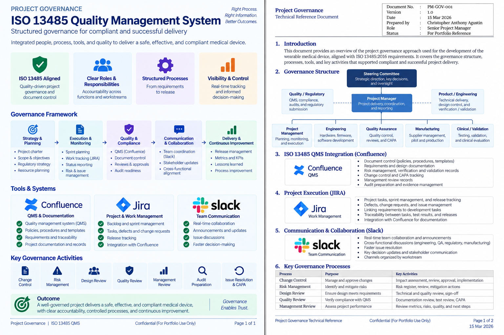

# Project Governance

Project governance provided the structure for decision-making, accountability, documentation, quality control, risk management, and cross-functional coordination across the project.

## Governance Framework

| Area | Focus |
|---|---|
| Project Management | Planning, monitoring, coordination, risks, issues, and delivery |
| Quality & Compliance | QMS, document control, traceability, verification, validation, and audit readiness |
| Engineering | Hardware, firmware, software, integration, and technical delivery |
| Manufacturing | Supplier coordination, production planning, quality, and readiness |
| Clinical / Validation | Testing, validation, clinical activities, and readiness |
| Stakeholder Communication | Cross-functional coordination, decisions, escalations, and updates |

## Governance Tooling

- **Confluence** — QMS and project documentation
- **Jira** — backlog, sprint work, tasks, defects, issues, and delivery tracking
- **Slack** — day-to-day collaboration, issue discussion, and team communication

## ISO 13485 / QMS Integration

Project governance was connected with the quality-management environment to maintain visibility across documentation, requirements, risks, changes, verification, validation, and audit-readiness activities.

## Evidence

### Project Governance

[View Project Governance Reference](./project-governance.pdf)

## Related Project

[← Back to MEWS Case Study](../README.md)
