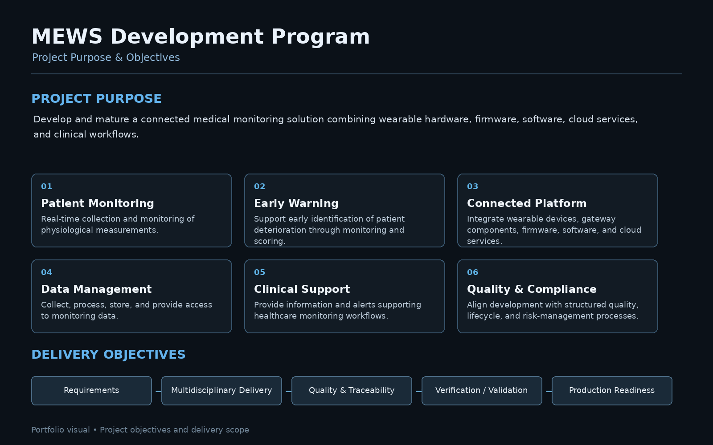

# Project & Objectives

The Medical Early Warning & Patient Monitoring Platform was developed to support real-time patient monitoring by combining wearable medical devices, software applications, cloud services, and clinical workflows into an integrated technology platform.

## Project Purpose

The project aimed to develop and mature a connected medical monitoring solution capable of collecting physiological data, processing patient information, generating early warning insights, and supporting healthcare professionals in monitoring patient conditions.

## Project Objectives

| Objective | Description |
|---|---|
| **Patient Monitoring** | Enable real-time collection and monitoring of physiological measurements |
| **Early Warning** | Support early identification of patient deterioration through clinical monitoring and scoring |
| **Connected Device Platform** | Integrate wearable devices, gateway components, firmware, software, and cloud services |
| **Data Management** | Securely collect, process, store, and provide access to patient monitoring data |
| **Clinical Support** | Provide information and alerts that support healthcare monitoring workflows |
| **Quality & Compliance** | Develop the product within structured quality, software lifecycle, and risk-management processes |
| **Validation Readiness** | Coordinate verification, validation, and clinical preparation activities |
| **Production Readiness** | Progress the product toward manufacturing, certification, and commercialization readiness |

## Project Scope

```text
Wearable Device
      ↓
Physiological Data Acquisition
      ↓
Gateway / Connectivity
      ↓
Cloud Platform
      ↓
Data Processing & Storage
      ↓
Monitoring Application
      ↓
Clinical Monitoring & Early Warning
```

The project involved coordination across:

- Hardware engineering
- Firmware development
- Software development
- Cloud infrastructure
- Systems integration
- Quality management
- Risk management
- Verification & validation
- Clinical activities
- Regulatory activities
- Manufacturing and supplier coordination

## Delivery Objectives

From a project-management perspective, the delivery objectives were to:

- Establish clear product and technical requirements
- Coordinate multidisciplinary engineering activities
- Manage project scope, priorities, risks, issues, and dependencies
- Align development activities with quality and compliance requirements
- Coordinate verification and validation activities
- Support clinical and regulatory readiness
- Coordinate manufacturing and production-readiness activities
- Maintain stakeholder visibility throughout the development lifecycle

## Evidence

### Project & Objectives


[View Project & Objectives Reference](./project-objectives.pdf)

## Related Project

[← Back to MEWS Case Study](../README.md)
