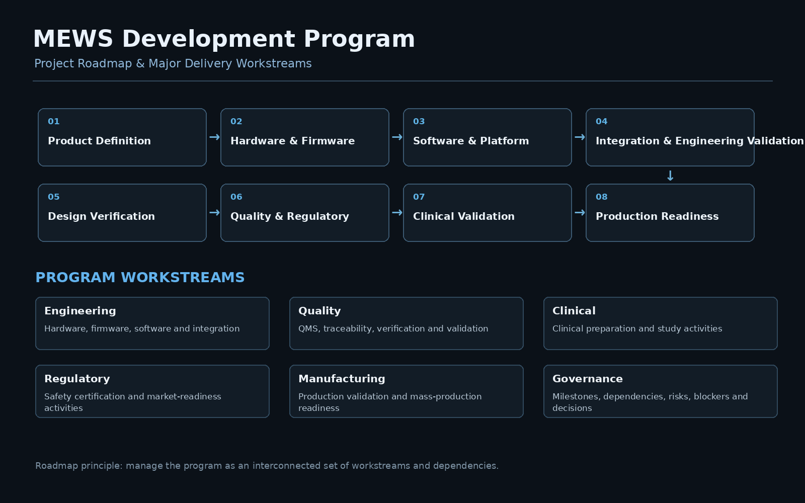

# Project & Roadmap

The project roadmap provided a high-level view of product development, engineering, quality, validation, clinical, regulatory, and manufacturing activities across the program lifecycle.

## Program Roadmap

```text
Product Definition
        ↓
Hardware & Firmware Development
        ↓
Software & Platform Development
        ↓
Integration & Engineering Validation
        ↓
Design Verification
        ↓
Regulatory & Quality Activities
        ↓
Clinical Preparation / Validation
        ↓
Production Validation
        ↓
Production Readiness
        ↓
Commercialization
```

## Major Workstreams

| Workstream | Focus |
|---|---|
| **Product Development** | Product requirements, planning, and overall solution development |
| **Hardware & Firmware** | Wearable device, electronics, sensing, firmware, and device integration |
| **Software & Platform** | Mobile application, backend services, cloud platform, and data management |
| **Integration** | Device, gateway, software, and platform interoperability |
| **Quality & Compliance** | QMS, ISO 13485, documentation, traceability, and quality activities |
| **Verification & Validation** | Engineering validation, design verification, testing, and validation |
| **Clinical** | Clinical preparation and study-related activities |
| **Regulatory** | Safety certification, regulatory activities, and market readiness |
| **Manufacturing** | Production validation, manufacturing preparation, and mass-production readiness |

## Roadmap Dependencies

The roadmap was managed as an interconnected program rather than a sequence of independent activities.

```text
Engineering Development
        │
        ├──────────────→ Design Verification
        │                       │
        │                       ↓
        │                Regulatory Activities
        │                       │
        ↓                       ↓
Integration ───────────→ Validation
                                │
                                ↓
                         Production Validation
                                │
                                ↓
                       Production Readiness
```

Key dependencies included:

- Hardware and firmware readiness affecting integration and verification
- Software and platform readiness affecting system validation
- Verification results affecting downstream regulatory and validation activities
- Quality and certification activities affecting production readiness
- Clinical preparation running alongside technical and quality workstreams
- Production validation depending on completion of required upstream activities

## PM Roadmap Responsibilities

My role was to maintain visibility across the major workstreams, dependencies, milestones, risks, blockers, and readiness activities while coordinating the different teams involved in the program.

## Evidence

### Project Roadmap


[View Project Roadmap Reference](./project-roadmap.pdf)

## Related Project

[← Back to MEWS Case Study](../README.md)
