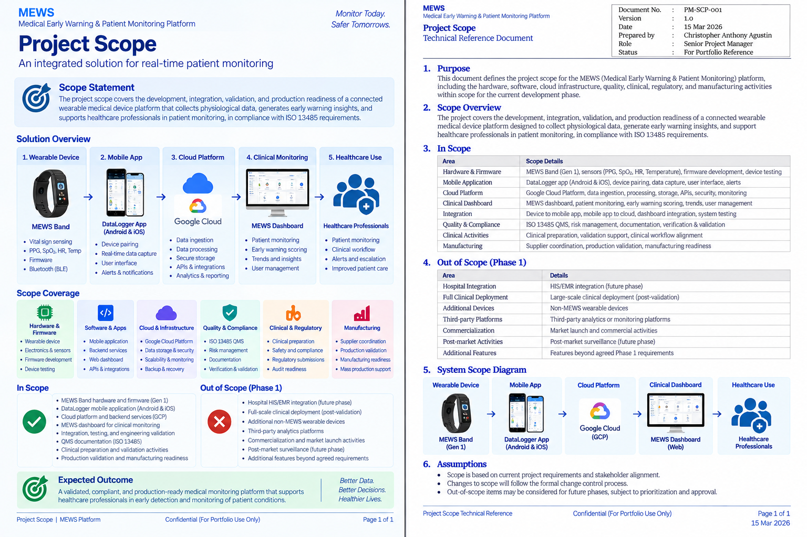

# Project Scope

The project scope defines the boundaries of the **Medical Early Warning & Patient Monitoring Platform**, covering the coordinated delivery of wearable hardware, firmware, mobile and cloud software, clinical monitoring, quality and compliance activities, validation, and manufacturing readiness.

## Scope Areas

### In Scope

- Product and solution requirements
- Wearable band and gateway hardware coordination
- Embedded firmware and device connectivity
- Mobile application and backend services
- Cloud infrastructure and platform integration
- Physiological data collection and processing
- Modified Early Warning Score (MEWS) functionality
- Monitoring dashboard and historical patient information
- External technology-partner integration
- Software testing, verification, and validation coordination
- Quality, risk, traceability, and documentation activities
- Clinical validation preparation and regulatory-readiness activities
- Manufacturing and production-readiness coordination

### Out of Scope / Portfolio Boundaries

- Clinical decisions and patient treatment
- Proprietary third-party algorithms and confidential partner materials
- Patient-identifiable information and sensitive data
- Credentials, security secrets, and controlled engineering source files
- Controlled regulatory and quality records

## Scope Management

The project required coordination across **software, hardware, firmware, quality, clinical activities, regulatory needs, vendors, and manufacturing readiness**.

Scope and dependencies were managed through requirements definition, prioritization, technical coordination, validation, documentation, and project governance.

## Evidence

### Project Scope

[View Project Scope Reference](./project-scope.pdf)

## Related Project

[← Back to MEWS Case Study](../README.md)
