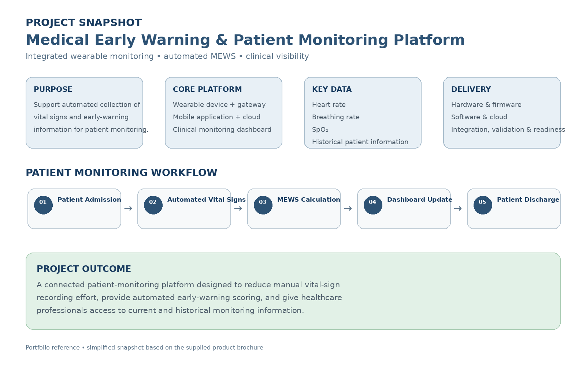

# Project & Snapshot

The **Medical Early Warning & Patient Monitoring Platform** is an integrated healthcare technology solution combining wearable monitoring, device connectivity, software, cloud services, and clinical monitoring workflows.

The platform is designed to collect physiological information, automatically calculate the **Modified Early Warning Score (MEWS)**, and provide healthcare professionals with current and historical patient monitoring information.

## Project Snapshot

| Area | Summary |
|------|---------|
| **Project Type** | Medical technology / patient monitoring platform |
| **Primary Purpose** | Automated vital-sign monitoring and early-warning support |
| **Core Components** | Wearable device, gateway, mobile application, cloud platform, clinical monitoring dashboard |
| **Key Measurements** | Heart rate, breathing rate, SpO₂, temperature and motion-related data |
| **Core Function** | Automated spot checks and MEWS calculation |
| **Data Flow** | Wearable → Gateway → Cloud Platform → Monitoring Dashboard |
| **Primary Users** | Healthcare professionals |
| **Delivery Scope** | Hardware, firmware, software, cloud, integration, validation, quality and manufacturing readiness |

## Patient Monitoring Workflow

```text
Patient Admission
       ↓
Vital Signs Recording
       ↓
Automated MEWS Calculation
       ↓
Dashboard Update
       ↓
Patient Discharge
```

## Solution Overview

### Wearable & Gateway

The wearable device collects physiological information while the gateway provides device connectivity and automated data transfer.

### Software & Cloud

The platform processes and synchronizes monitoring information through its software and cloud components.

### Clinical Monitoring

Healthcare professionals can view current vital-sign information, MEWS results, and historical patient information through the monitoring interface.

## Project Characteristics

- Cross-functional hardware and software delivery
- Wearable device and gateway integration
- Physiological data collection
- Automated spot-check workflow
- MEWS calculation
- Cloud-based data synchronization
- Clinical monitoring and historical information
- Quality, validation, and production-readiness activities

## Evidence

### Project Snapshot


[View Project Brochure](./brochure.pdf)

[View Project Snapshot Reference](./project-snapshot.pdf)

## Related Project

[← Back to MEWS Case Study](../README.md)
