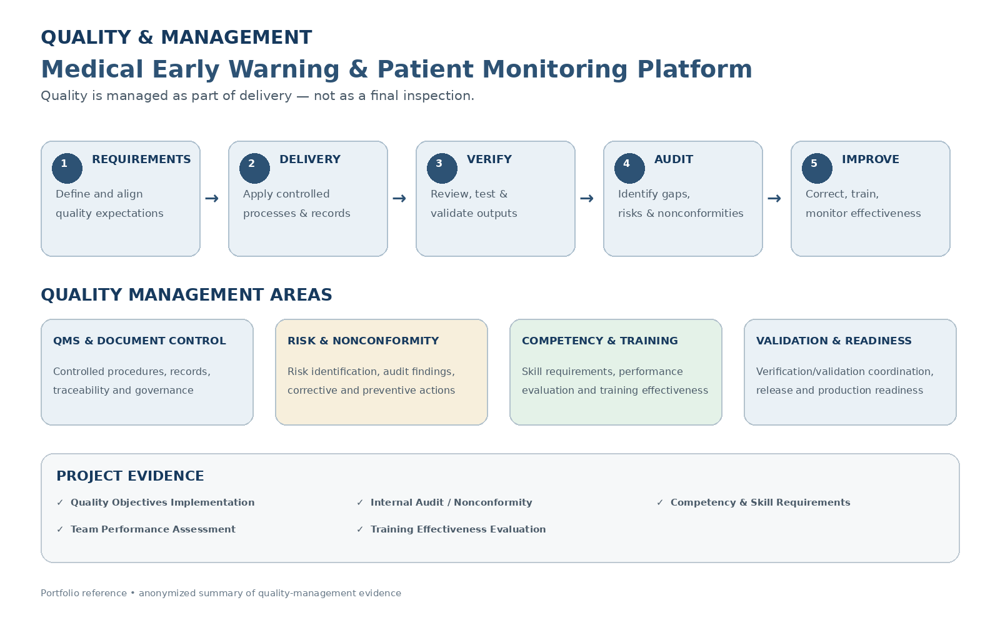

# Quality & Management

Quality management was integrated into project delivery through **QMS alignment, controlled documentation, requirements traceability, risk management, verification and validation, audit activities, competency management, training, and continual improvement**.

## Quality Management Approach

The project applied quality practices across the delivery lifecycle rather than treating quality as a final-stage activity.

Key areas included:

- Quality Management System (QMS) alignment
- Documentation and records
- Requirements traceability
- Risk and issue management
- Verification and validation coordination
- Change and corrective-action support
- Audit readiness
- Competency and training management
- Continual improvement

## Quality Objectives

A documented quality-objectives initiative used a structured implementation sprint to:

- Define measurable quality objectives
- Align daily responsibilities with QMS goals
- Identify blockers, risks, and process gaps
- Define competency and training needs
- Finalize documentation for implementation

The implementation included team feedback, analysis, objective definition, management review, and rollout preparation.

## Competency & Training

Quality management also covered people and organizational capability.

Evidence included:

- Skill requirements
- Team-member performance assessment
- Training effectiveness evaluation
- Competency-gap identification
- Training planning and follow-up

Performance assessment areas included **scope, quality, schedule, cost, communication, collaboration, conflict management, decision making, and leadership**.

## Internal Audit & Corrective Action

Internal audit activities identified gaps in the alignment between:

```text
Skill Requirements
        ↓
Job Descriptions
        ↓
Performance Evaluation
        ↓
Training Requirements
        ↓
Training Implementation
```

The corrective-action approach included reviewing competency and job-description documents, updating the training calendar, clarifying evaluation processes, and establishing a clearer linkage between competency gaps and training activities.

## Project Manager Contribution

As Project Manager, I connected quality requirements with project execution by coordinating:

- Quality objectives
- Competency activities
- Audit follow-up
- Corrective actions
- Documentation
- Stakeholder review
- Training and development activities
- Project readiness

This provided a practical connection between **project delivery, people capability, quality management, and continual improvement**.

## Evidence

### Quality & Management


[View Quality & Management Reference](./quality-management.pdf)

### Internal Audit Non-Conformity

[View Anonymized Internal Audit Non-Conformity Sample](./internal-audit-nonconformity-sample.pdf)

## Related Project

[← Back to MEWS Case Study](../README.md)
