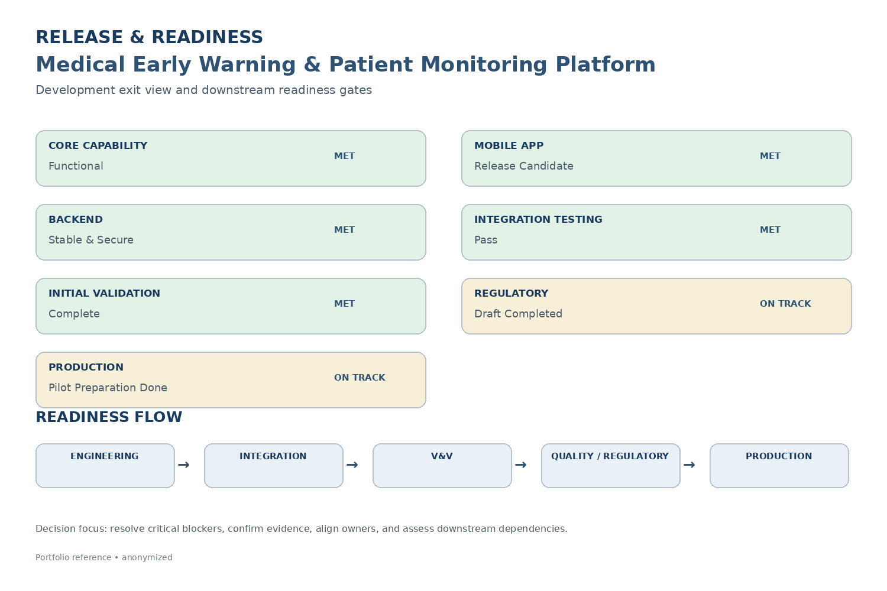

# Release & Readiness

Release readiness focused on confirming that technical delivery, integration, verification and validation, quality, regulatory, and production dependencies were sufficiently understood before progressing to the next project phase.

## Development Exit View

| Readiness Area | Status |
|---|---|
| **Core Monitoring Capability** | Functional |
| **Mobile Application** | Release Candidate |
| **Backend System** | Stable & Secure |
| **Integration Testing** | Pass |
| **Initial Validation Testing** | Complete |
| **Regulatory Readiness** | Documentation Draft Completed / On Track |
| **Production Readiness** | Pilot Preparation Done / On Track |

## Readiness Areas

- Requirements and scope alignment
- Hardware / firmware integration readiness
- Software and backend readiness
- Integration testing and issue closure
- Verification and validation evidence
- Quality and QMS documentation
- Regulatory documentation readiness
- Manufacturing / pilot-production readiness
- Handover and outstanding-item ownership

## Readiness Flow

```text
Engineering
     ↓
Integration
     ↓
Verification & Validation
     ↓
Quality / Regulatory
     ↓
Production Readiness
```

## Project Manager Focus

The PM role was to maintain visibility of **milestones, dependencies, blockers, validation requirements, regulatory activities, and production-readiness items**, and coordinate owners and stakeholders when issues could affect downstream delivery.

## Transition

The development phase reached a point where core functionality, integration testing, and initial validation activities were completed, while regulatory documentation and production readiness continued as downstream activities.

## Evidence

### Release & Readiness


[View Release & Readiness Reference](./release-readiness.pdf)

## Related Project

[← Back to MEWS Case Study](../README.md)
