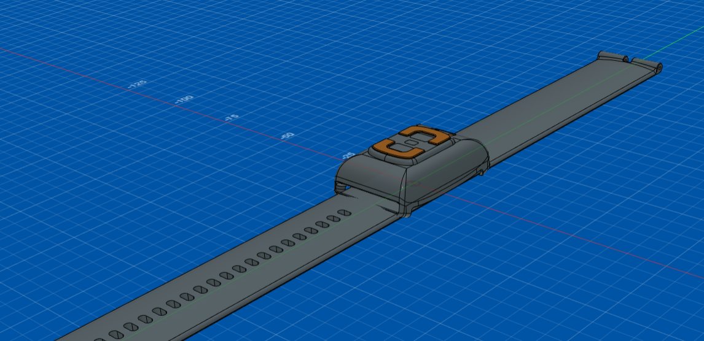
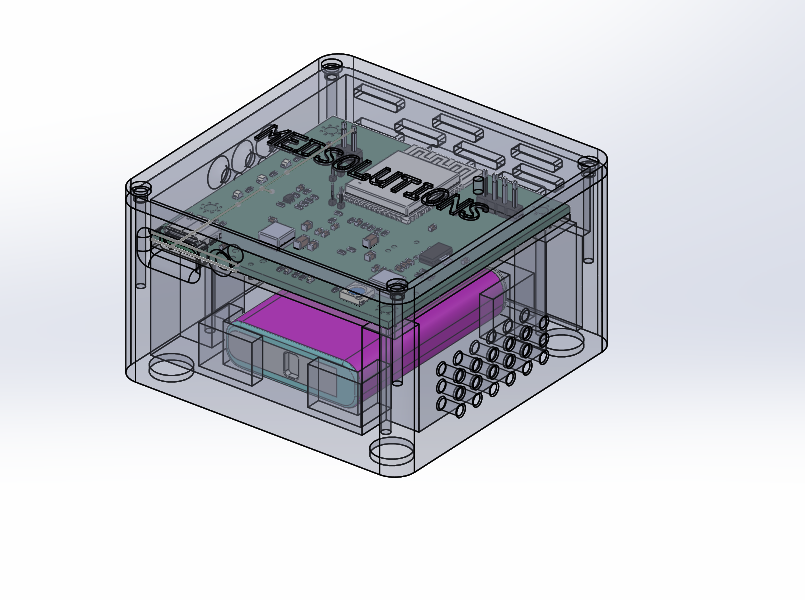

# Requirements

Requirements management covered the translation of **business, user, system, software, hardware, integration, quality, and validation needs** into structured and traceable requirements.

## Requirements Approach

The project required requirements to remain aligned across multiple workstreams:

```text
Business / User Needs
        ↓
System Requirements
        ↓
Software / Hardware Requirements
        ↓
Design Inputs
        ↓
Implementation
        ↓
Verification & Validation
        ↓
Release Readiness
```

Because the platform combined **wearable hardware, firmware, mobile software, backend services, cloud infrastructure, and external integrations**, requirements also had to account for cross-component dependencies and downstream validation activities.

## Sample Requirements Documents

### Software Requirements Specification

[View SRS Sample](./srs-sample.pdf)

### Design Input Document

[View DID Sample](./did-sample.pdf)

## Product & Design References

The following supplied images provide visual context for the physical components represented by the requirements and design inputs.

### Wearable Device



[View Wearable Front Reference](./band-front.png)

[View Wearable Prototype Reference](./band-prototype-1.jpg)

[View Wearable-on-User Reference](./band-worn.png)

### Gateway


[View Gateway Front Reference](./gateway-front.png)

## Requirements Traceability

Requirements were considered together with design, implementation, testing, validation, and change management activities.

```text
Requirement
    ↓
Design Input
    ↓
Implementation
    ↓
Verification
    ↓
Validation
    ↓
Release
```

## Requirements Management Focus

- Requirements gathering and analysis
- Functional and technical requirements
- Requirements prioritization
- Design-input definition
- Requirements traceability
- Cross-functional dependency management
- Change-impact assessment
- Verification and validation coordination
- Stakeholder review and alignment

## Evidence

### Requirements

[View SRS Sample](./srs-sample.pdf)

[View Design Input Document Sample](./did-sample.pdf)

## Related Project

[← Back to MEWS Case Study](../README.md)
