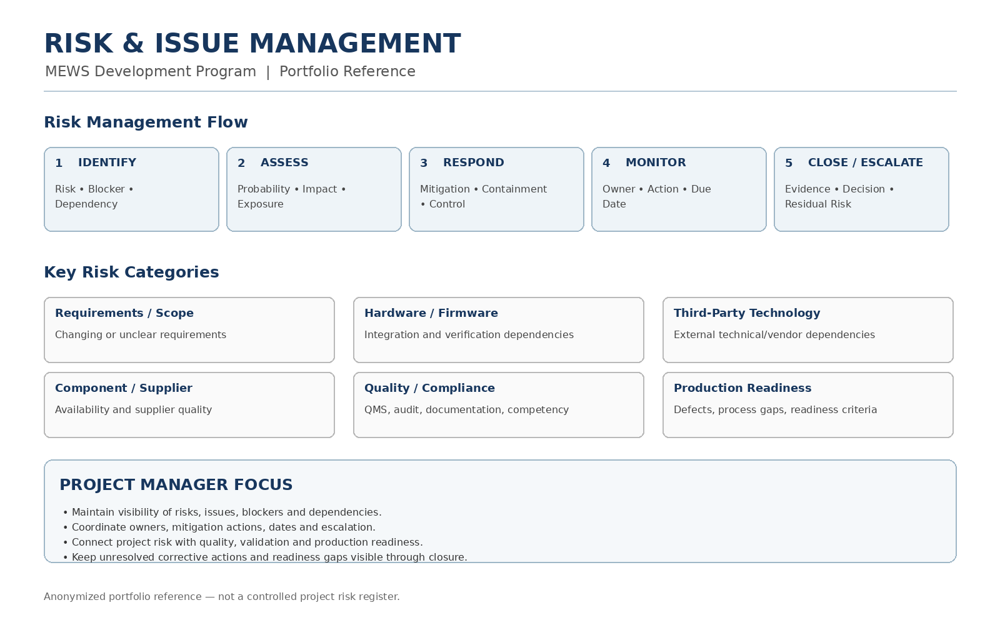

# Risk & Management

Risk management was an ongoing project activity covering **project risks, technical dependencies, blockers, quality concerns, supplier issues, and production-readiness risks**.

## Risk Management Approach

Risks and issues were identified through project execution, stakeholder discussions, quality activities, technical reviews, supplier coordination, and readiness assessments.

```text
Identify
    ↓
Assess
    ↓
Mitigate / Control
    ↓
Monitor
    ↓
Close / Escalate
```

## Key Risk Areas

- Requirements and scope changes
- Hardware and firmware dependencies
- Third-party technology and vendor dependencies
- Component availability and supplier quality
- Quality and compliance gaps
- Verification and validation dependencies
- Production-readiness gaps
- Defects, blockers, and corrective actions

## Project Manager Focus

The project-management role included:

- Maintaining visibility of risks, issues, blockers, and dependencies
- Coordinating risk assessment and mitigation activities
- Tracking owners, actions, dependencies, and target dates
- Assessing delivery impact of changes and emerging issues
- Coordinating with engineering, quality, regulatory, manufacturing, and external stakeholders
- Escalating risks that could affect milestones, validation, compliance, or production readiness
- Keeping unresolved issues and corrective actions visible through closure

## Risk & Quality Alignment

Risk management was connected with the project's regulated development environment, including **ISO 14971 risk-management activities**, ISO 13485 quality processes, and IEC 62304 software lifecycle practices.

Risk considerations therefore extended beyond schedule and cost to include **product safety, technical dependencies, verification and validation, documentation, supplier quality, and production readiness**.

## Evidence

### Risk & Issue Management


[View Sample Risk Register](./risk-management-sample.pdf)

[View Risk & Issue Management Reference](./risk-management.pdf)

## Related Project

[← Back to MEWS Case Study](../README.md)
