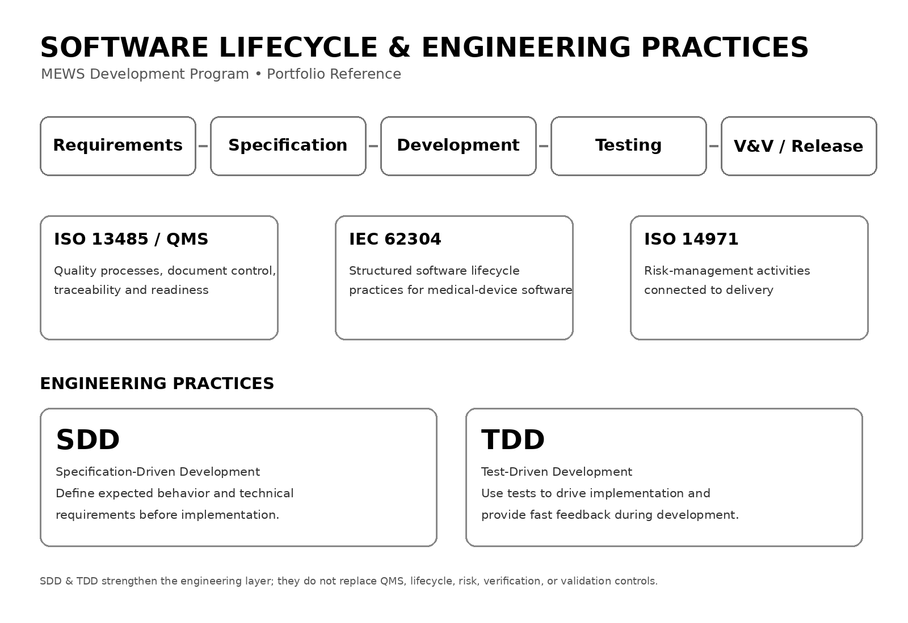

# Software & Lifecycle

The MEWS program used a structured software lifecycle within a regulated medical-device development environment, combining **software development practices, quality management, requirements traceability, testing, and project governance**.

## Integrated Software Delivery Model

```text
Requirements
      ↓
Specification / Design
      ↓
Development
      ↓
Testing
      ↓
Verification & Validation
      ↓
Release Readiness
      ↓
Deployment / Support
```

Software delivery was managed within a **hybrid Agile-Waterfall framework**, with Scrum practices supporting software teams while hardware development progressed through EVT, DVT, PVT, and mass-production readiness phases.

## Quality & Software Lifecycle

The project involved:

- **ISO 13485** — Quality Management System processes
- **IEC 62304** — Software lifecycle practices
- **ISO 14971** — Risk-management activities
- Requirements traceability
- QMS documentation and document governance
- Testing and validation coordination
- Audit-readiness support
- Clinical-validation preparation

## Engineering Practices

### Specification-Driven Development (SDD)

SDD supported structured development by defining expected behavior, requirements, and technical specifications before implementation.

### Test-Driven Development (TDD)

TDD supported software engineering by using tests to drive implementation and provide early feedback during development.

SDD and TDD were treated as **engineering practices within the broader software lifecycle**, rather than replacements for quality-management, risk-management, verification, or validation activities.

## Project Manager Contribution

The Senior Project Manager coordinated the software lifecycle across:

- Requirements and scope
- Software development
- Documentation and traceability
- Engineering teams
- Quality and compliance
- Testing and validation
- Hardware and firmware dependencies
- Release readiness
- Clinical-validation preparation
- Audit readiness

The focus was to maintain alignment between **project delivery, engineering execution, quality requirements, and regulatory readiness**.

## Evidence

### Software Lifecycle & Engineering Practices


[View Software Lifecycle Reference](./software-lifecycle.pdf)

## Related Project

[← Back to MEWS Case Study](../README.md)
