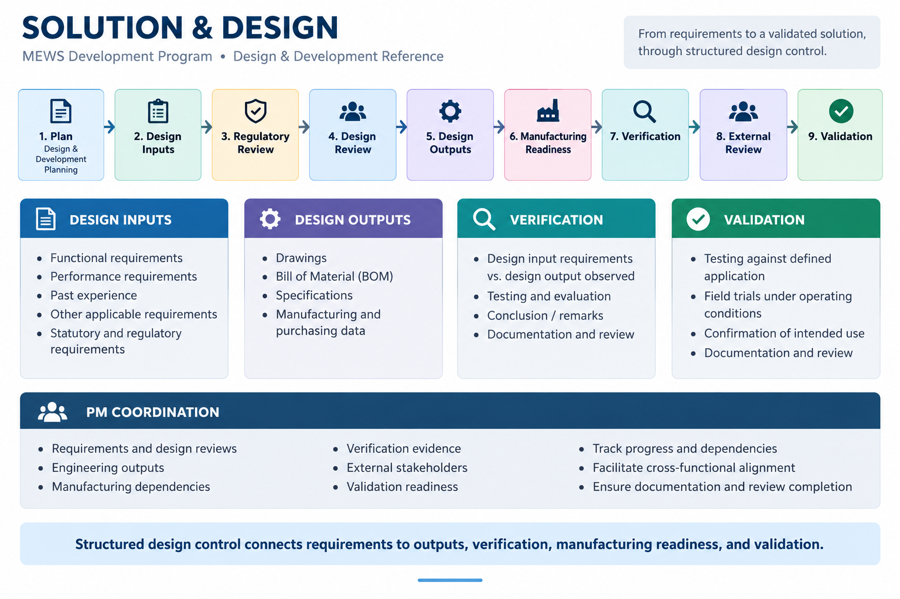

# Solution & Design

The MEWS program followed a structured design and development process connecting **requirements, design activities, engineering outputs, manufacturing considerations, verification, external review, and validation**.

## Design & Development Framework

```text
Design & Development Planning
            ↓
Design Inputs
            ↓
Statutory & Regulatory Review
            ↓
Internal Design Review
            ↓
Design Outputs
            ↓
Manufacturing Capability
            ↓
Design Verification
            ↓
External Design Review
            ↓
Design Validation
```

## Design Inputs

The design process considered:

- Functional requirements
- Performance requirements
- Past experience
- Other applicable requirements
- Statutory and regulatory requirements

## Design Reviews

Internal design review was used to evaluate the design before progressing to defined design outputs and subsequent development activities.

External review could involve:

- Customer review, where required
- Purchasing personnel
- Manufacturing personnel
- Clarification of design and production requirements

## Design Outputs

The Design and Development Plan identifies key design outputs including:

- Drawings
- Bill of Material (BOM)
- Specifications
- Manufacturing and purchasing data

These outputs provided the basis for manufacturing and verification activities.

## Manufacturing Considerations

The design process also considered:

- Manufacturing capability
- Process adequacy
- Equipment adequacy
- Release of manufacturing data
- Purchasing data

This connected solution design with practical production-readiness requirements.

## Design Verification

Design verification established a relationship between:

```text
Design Input Requirements
          ↓
Design Output Observed
          ↓
Verification Conclusion
          ↓
Remarks / Follow-up
```

The Design and Verification Report provided structured fields for recording the design input requirements, observed design outputs, conclusion, remarks, and review acknowledgement.

## Design Validation

The design-development process included validation through:

- Product testing
- Testing against the defined application
- Field trials under operating conditions

## Technical Project Management Perspective

From a Technical Project Management perspective, the role was to coordinate the activities and dependencies across **requirements, engineering, quality, manufacturing, verification, external stakeholders, and validation**.

The focus was on maintaining alignment between:

**Requirements → Design → Engineering Outputs → Verification → Validation → Delivery Readiness**

The detailed engineering design and verification activities remained with the appropriate technical personnel, while project management provided coordination, visibility, scheduling, review, and delivery governance.

## Evidence

### Solution & Design


[View Solution & Design Reference](./solution-design.pdf)

## Related Project

[← Back to MEWS Case Study](../README.md)
