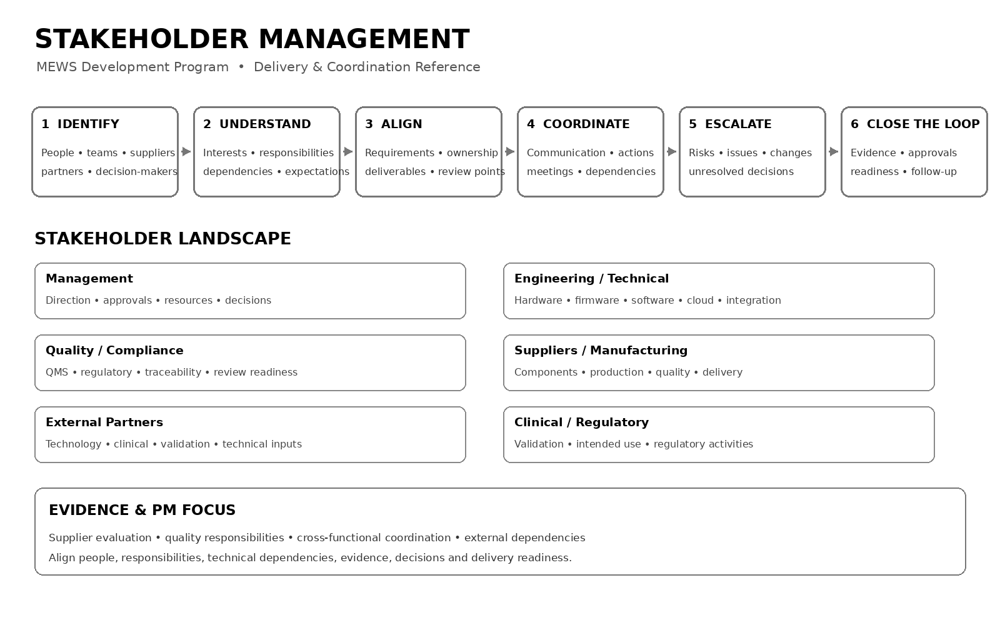

# Stakeholders

Stakeholder management for the MEWS program involved coordination across **management, engineering, quality/compliance, suppliers, manufacturing, external technology partners, clinical stakeholders, and regulatory activities**.

## Stakeholder Landscape

| Stakeholder Group | Typical Interest / Contribution |
|---|---|
| Management | Direction, approvals, resources, delivery decisions |
| Engineering & Technical Teams | Hardware, firmware, software, cloud and integration |
| Quality / Compliance | QMS, regulatory requirements, traceability and review readiness |
| Suppliers / Manufacturing Partners | Components, manufacturing, quality and delivery |
| External Technology Partners | Technology integration, technical inputs and validation support |
| Clinical / Validation Stakeholders | Intended use, validation and operational evidence |
| Regulatory / External Review | Applicable requirements, evidence and submission activities |

## Supplier & Partner Management

The supplied project evidence includes a **Supplier Evaluation and Approval Form** covering document verification, reference checks, site/factory visits where applicable, sample approval, evaluation criteria, recommendation and formal approval.

The supplied **Supplier Quality Agreement** defines responsibilities around specifications, regulatory and quality requirements, traceability, manufacturing changes, audits, nonconformities and corrective actions.

These records provide concrete evidence of stakeholder and supplier coordination rather than relying only on a generic stakeholder-management description.

## Stakeholder Management Approach

```text
Identify
   ↓
Understand
   ↓
Align
   ↓
Coordinate
   ↓
Escalate
   ↓
Close the Loop
```

The Technical Project Management focus was to maintain alignment across **people, responsibilities, technical dependencies, quality requirements, external partners, evidence, decisions, and delivery readiness**.

## Evidence

### Stakeholder Management


[View Sample Stakeholder Register](./stakeholder-management.pdf)

[View Stakeholder Management Reference](./stakeholder-management.pdf)

## Evidence Boundary

This portfolio presentation intentionally omits personal contact details, supplier addresses, confidential commercial information, proprietary identifiers, controlled quality records, and restricted project information.

## Related Project

[← Back to MEWS Case Study](../README.md)
