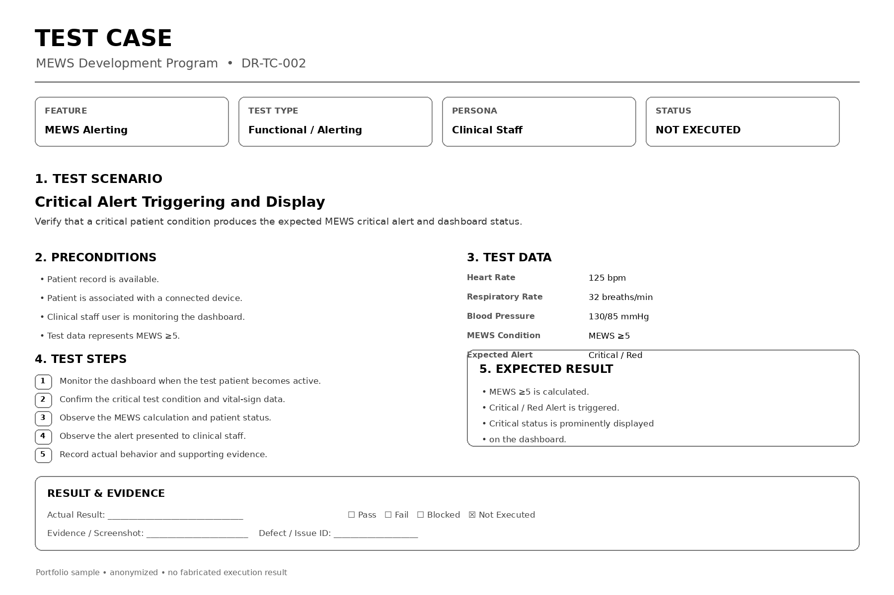

# Testing & Validation

Testing and validation for the MEWS program covered both **software functionality and connected medical-device components**, including the wearable band and gateway.

The testing approach connected requirements to test cases, execution, verification evidence, defect follow-up, and validation readiness.

## Testing & Validation Flow

```text
Requirements
     ↓
Test Design
     ↓
Test Data & Prerequisites
     ↓
Test Execution
     ↓
Expected vs. Actual Results
     ↓
Defect / Issue Follow-up
     ↓
Verification
     ↓
Validation
     ↓
Release Readiness
```

## Test Coverage

| Test Area | Coverage |
|---|---|
| **Functional Testing** | Dashboard, MEWS calculation, alerting, user actions, discharge and configuration |
| **Integration Testing** | Band, gateway, wireless communication and device status |
| **Hardware Testing** | Sensor accuracy, mechanical and physical stress, durability |
| **Battery Testing** | Battery life, charging/discharging, overcharge and over-discharge protection |
| **Firmware Testing** | Firmware reliability, wireless communication and firmware security |
| **Burn-in Testing** | Temperature, functional testing, power cycling, waterproof testing and failure analysis |
| **Validation** | Testing under defined application and operating conditions |

## Representative Test Cases

The supplied Dry Run Test Cases used a structured test-case format covering:

- Feature
- PBI
- Test Case ID
- Scenario
- Persona
- Prerequisites
- Test Steps
- Expected Results
- Actual Results
- Status
- Test Data
- Screenshots
- Remarks

Representative scenarios included:

| Test Case | Scenario | Purpose |
|---|---|---|
| **DR-TC-001** | Initial Load & High-Risk Sorting | Verify dashboard loading and risk prioritization |
| **DR-TC-002** | Critical Alert Triggering | Verify critical MEWS alert generation and display |
| **DR-TC-003** | Staff Acknowledgement & Audit | Verify alert acknowledgement and audit logging |
| **DR-TC-004** | Patient Discharge & Archival | Verify discharge and record archival workflow |
| **DR-TC-006** | Device Disconnection | Verify device offline/disconnected status handling |
| **DR-TC-008** | First-Time Login | Verify mandatory password-change workflow |
| **DR-TC-009** | Configuration Verification | Verify rooms, gateways, bands and system relationships |

## Band & Gateway Testing

The project test requirements included testing across the wearable band and gateway.

### Reliability Testing

- Sensor accuracy against calibrated medical equipment
- Measurement consistency under different conditions
- Impact resistance
- Vibration testing
- Shock testing
- Strap and buckle durability
- Power and battery testing

### Battery Testing

- Battery life
- Charging and discharging
- Overcharge protection
- Over-discharge protection

### Firmware & Communication

- Firmware reliability
- Wireless communication
- Firmware security testing

### Burn-in Testing

- High- and low-temperature testing
- Functional testing
- Power cycling
- Automated Test Equipment (ATE)
- Waterproof testing
- Failure criteria and analysis

## Verification

Verification focused on demonstrating that defined requirements were satisfied by the corresponding design or system output.

A typical verification record connects:

```text
Design / System Requirement
          ↓
Test Case
          ↓
Expected Result
          ↓
Actual Result
          ↓
Evidence
          ↓
Verification Conclusion
```

## Validation

Validation addressed whether the system performed as intended for its **defined application and operating conditions**.

This included consideration of:

- Product testing
- Defined application scenarios
- Field or operating-condition testing
- Clinical validation activities
- Measurement consistency under different conditions

## Technical Project Management Contribution

As Senior Project Manager, I coordinated testing and validation activities across **software, firmware, hardware, quality, and other project stakeholders**.

My focus included:

- Defining and coordinating test scope
- Tracking test readiness
- Coordinating dependencies between teams
- Managing test schedules and milestones
- Tracking defects and issues
- Coordinating verification evidence
- Supporting validation readiness
- Coordinating review and approval activities
- Supporting release and go-live readiness

Detailed technical test execution remained with the appropriate engineering and testing personnel.

## Evidence

### Testing & Validation Sample


[View Sample Testing & Validation](./testing-validation-sample.pdf)

[View Testing & Validation Reference](./testing-validation.pdf)

## Evidence Boundary

The portfolio sample is anonymized and does not reproduce patient information, credentials, proprietary algorithms, confidential supplier information, or controlled project records.

The showcased test cases are representative of the supplied project test materials. No fabricated pass/fail results are presented.

## Related Project

[← Back to MEWS Case Study](../README.md)
